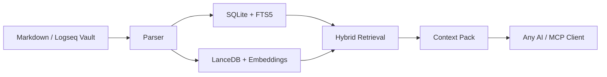

<div align="center">

# 🌌 OmniClip RAG

<p align="center"><strong>A silent gravity field between your private notes and the universe of AI.</strong></p>
<p align="center"><em>(Supports 1290 formats since V0.3.3, and ships an MCP Registry / MCPB line since V0.4.1)</em></p>


<br/>

[](CHANGELOG.md) [](#-quick-start--workflow) [](pyproject.toml) [](#-core-philosophy--priceless-boundaries) [](https://github.com/msjsc001/OmniClip-RAG/releases) [](https://registry.modelcontextprotocol.io/v0/servers?search=io.github.msjsc001/omniclip-rag-mcp) [](README.zh-CN.md) [](LICENSE)

[中文说明](README.zh-CN.md) | [Changelog](CHANGELOG.md) | [Architecture](ARCHITECTURE.md) | [MCP Setup](MCP_SETUP.md) | [Website](https://msjsc001.github.io/OmniClip-RAG/)

<br/>

<details>
<summary>📖 <b>Table of Contents</b> (Click to expand)</summary>

- [TL;DR: MCP Quickstart](#-mcp-usage)
- [Core Philosophy & Priceless Boundaries](#-core-philosophy--priceless-boundaries)
- [Core Features](#-core-features)
- [Quick Start & Workflow](#-quick-start--workflow)
- [MCP Usage](#-mcp-usage)
- [High-Leverage Mental Models & Workflows](#-high-leverage-mental-models--workflows)
- [Minimalist & Restrained Architecture](#-minimalist--restrained-architecture)
- [Geek & Developer Entry Points](#-geek--developer-entry-points)
- [Recent Version Trace](#-recent-key-updates)
- [Documentation Hub](#-documentation-hub)
- [Open Source Thanks & License](#-open-source-thanks)

</details>

</div>

<br/>

> [!TIP]
> **TL;DR: MCP Quickstart**
>
> OmniClip RAG now ships a **read-only local-first MCP server** for searching private Markdown, PDF, and Tika-backed knowledge bases on Windows.
> Download `OmniClipRAG-MCP-v0.4.3-win64.zip` for manual `stdio` setup or `omniclip-rag-mcp-win-x64-v0.4.3.mcpb` for the official MCP Registry / MCPB path.
> Point your MCP client at `OmniClipRAG-MCP.exe`, then ask the AI to call `omniclip.status` first and `omniclip.search` for the actual retrieval flow. Full details: [MCP_SETUP.md](MCP_SETUP.md).

---

**What is it?** It is a local Markdown semantic search software, a local RAG knowledge base, and now a read-only MCP retrieval server. 

**How to use it?** Just open the application, input your Markdown notes path, and click "Build Knowledge Base" to set up your local RAG vault. Once built, you can use it to semantically search your notes. The retrieved content can be copied and sent to any AI for in-depth discussion, or used for your own deep reading.

**What are the benefits?** No need to upload any of your data, and no vendor lock-in. It requires no complex configuration or setup. Moreover, it features hot-reloading—newly written notes automatically enter the RAG vault! New notes can also be an organized collection of your historical conversations with AIs, which in turn implicitly provides a permanent memory for them.

> [!NOTE]
> **Introduction: Handing Over Our "Cyber-Underwear" in the AI Era!**
> 
> **OmniClip RAG uniquely achieves the impossible: You can have it all!**
>
> - **We Demand**: Our Markdown notes remain completely ours.
> - **We Also Demand**: Any AI to deeply participate within our permitted and supervised scope. The note vault and the AI must be deeply decoupled yet highly interactive.
> - **And We Demand**: An out-of-the-box experience without any tedious setup, featuring a robust hot-reload capability so new notes automatically enter the RAG semantic pool! It can even compile your historical AI conversations, granting your LLMs a permanent, rolling memory.
>
> In the AI era, the more we rely on large models, the more personal privacy we surrender. Most knowledge base RAG tools on the market are either agonizingly complex to configure (involving server-like Docker or Python environments), demand a steep learning curve that costs too much time, forcibly tether you to a bloated chat interface, or require you to upload your notes completely. They all attempt to lock your data into their products, making it impossible for you to ever leave them.
>
> To ensure my notes and thoughts genuinely remain mine, I spent considerable time thinking through and comparing numerous possibilities before finalizing and hand-crafting this pure local semantic retrieval tool—**OmniClip RAG**. I pushed its core functionalities to the absolute limit, ensuring that it **both** runs smoothly on most computers **and** maintains professional-grade capabilities. It functions as a local knowledge firewall, allowing you to selectively let AI deeply read your "second brain" without worrying about your data being hijacked by any cloud or local software.

<br/>

<div align="center">
  
</div>

<br/>

---

## 🎯 Core Philosophy & Priceless Boundaries

**OmniClip RAG** is a radically decoupled "privacy firewall" and "manual-transfer local RAG search engine" meticulously crafted for the Markdown note ecosystem (natively compatible with Logseq, Obsidian, Typora, MarkText, Zettlr, and any plain text application).

It exclusively performs one highly refined task: it semantic-searches tens of thousands of pages locally via embedded vector algorithms (e.g., `BAAI/bge-m3`) and structural indexing, meticulously packs the most high-value contextual snippets, and lets you **manually clip and paste them into any external top-tier AI** (such as ChatGPT, Claude, Kimi, etc.) for profound interactions. In short: As long as your materials are in Markdown formats, this engine acts as the ultimate "second brain permanent memory extractor."

<details>
<summary><b>👉 Click to expand: Why Was It Built This Way? (Core Philosophy)</b></summary>

<br/>

- **Absolute Privacy Isolation**: External AIs can *only* leverage the contextual fragments you explicitly bundle and offer via the semantic engine under your supervision. They have zero access to the rest of your vault. Your absolute data sovereignty is inviolable here.
- **A Highly Decoupled "Brain-Machine Interface"**: It binds to no single AI chat UI. If Claude handles complex code better today, you clip content to Claude. If GPT-5 transforms logic modeling tomorrow, you feed the same snippet there. This ensures physical independence between the tool and note content, freeing you from setup locking and platform binding.
- **Pursuing the "Strong Lindy Effect"**: I hope this serves as a memory lighthouse that won't become obsolete in the distant future. As long as the concept of plain text and Markdown persists, you will be able to summon faded historical insights you’ve personally forgotten, powered tightly by this clean and lightweight engine.

</details>

<br/>

---

## ✨ Core Features

OmniClip is intentionally not trying to win with flashy UI tricks. The real work went into making local knowledge retrieval dependable, explainable, and maintainable without forcing users into cloud upload or environment chaos.

<table width="100%">
  <tr>
    <td width="50%" valign="top">
      <ul>
        <li><b>Local-first by default</b>: indexes, logs, caches, and runtime payloads are managed under <code>%APPDATA%\OmniClip RAG</code> instead of polluting your source notes or requiring a cloud round-trip.</li>
        <li><b>Deep Markdown / Logseq understanding</b>: beyond plain Markdown, the parser understands Logseq-style page properties, block properties, block refs, and embeds, so retrieval stays closer to how you actually write.</li>
        <li><b>Real hybrid retrieval</b>: combines <code>SQLite + FTS5 + structure-aware scoring + LanceDB vector search</code> so it can catch both exact terms and semantically related ideas.</li>
        <li><b>Physically isolated extension formats</b>: Markdown, PDF, and Tika-backed formats keep separate indexes and states, returning unified results with explicit source labels.</li>
        <li><b>Traceable query results</b>: results carry source labels, page/format identity, score hints, and state messaging so users can understand why something was returned instead of trusting a black box.</li>
      </ul>
    </td>
    <td width="50%" valign="top">
      <ul>
        <li><b>Large Tika format exposure</b>: exposes <b>1290</b> extension formats with clear risk tiers for recommended, unknown, untested, and poor-compatibility items.</li>
        <li><b>Lean packaged app, external Runtime</b>: the EXE stays lightweight while Runtime components are managed separately, with shared AppData installation and legacy-runtime reuse.</li>
        <li><b>Build flows that explain themselves</b>: preflight, rebuild, incremental watch, and Tika auto-install surface stage, progress, and failure reasons instead of leaving users staring at a frozen screen.</li>
        <li><b>Degrade before crashing</b>: damaged files, empty files, offline paths, missing runtime pieces, and GPU pressure are all handled with skip/retry/fallback strategies wherever possible.</li>
        <li><b>A standard MCP interface</b>: <code>OmniClipRAG-MCP.exe</code> exposes the same local search kernel through a read-only MCP server, so MCP-capable AI clients can query your private knowledge base.</li>
      </ul>
    </td>
  </tr>
</table>

<br/>

<div align="center">
  <table width="100%" border="0">
    <tr>
      <td width="50%" align="center">
        <br/>
        <em>⚙️ Configuration and Indexing UI</em>
      </td>
      <td width="50%" align="center">
        <br/>
        <em>🌙 Dark Mode Aesthetics</em>
      </td>
    </tr>
  </table>
</div>

<br/>

---

## 🚀 Quick Start & Workflow

OmniClip perfectly integrates smoothly into your workflow:
1. Continue writing quietly in your local Markdown vault for extended periods.
2. Double click the OmniClip app—it will transparently and silently maintain a mixed-search index of your vault.
3. When searching for insights, punch in keywords or short sentences. OmniClip will extract and assemble unparalleled fragments in a single click.
4. **Paste that rich context bundle directly into the smartest AI model available at the moment.**

### First-Time Use Guide

The foundation is built as a single portable green EXE. No complicated scripting or dev environments are needed. Just pure **"Download, double-click, and run"**:

1. Launch the desktop app interface.
2. Select the root folder of your note vault.
3. Confirm the data directory (OmniClip refuses to soil or modify your raw notes).
4. *(First run)* Initiate the **space-and-time precheck** to estimate load constraints.
5. *(First run)* Start a **one-click model bootstrap (downloads and caches the local model)**.
6. Finally, trigger a **Full Build** (index once, run forever via hot reload tracking).
7. **Once built, start searching!** Find brilliant slices, click to copy snippets, and send them to your favorite LLMs.

<div align="center">
  
</div>

<br/>

---

## 🔌 MCP Usage

`OmniClip RAG MCP Server` lets MCP-capable AI clients search your local knowledge base through the same read-only retrieval core that powers the desktop app.

From `v0.4.3`, the MCP line is packaged in two parallel distribution forms:
- `OmniClipRAG-MCP-v0.4.3-win64.zip` for manual file-based setup
- `omniclip-rag-mcp-win-x64-v0.4.3.mcpb` for the official MCP Registry and MCPB-aware clients

> [!CAUTION]
> **What You Need First**
> Use `OmniClipRAG-MCP.exe` only as the headless read-only bridge for AI clients. It does not build knowledge bases. You MUST **build or install your knowledge base from the desktop app first**. 
> If your index has not been built yet, the MCP side will return an explicit `index_not_ready` style error instead of silently pretending everything is fine.

<details>
<summary><b>🛠️ Click to expand: Official Route & Traditional Setup Guide</b></summary>

<br/>

### Official Route (Registry / MCPB)

Since `v0.4.1`, OmniClip RAG keeps a first-class MCP Registry / MCPB line, so clients that support Registry discovery or MCPB installation can use that path first.
- If your client supports Registry discovery, look for: `io.github.msjsc001/omniclip-rag-mcp`
- If your client supports MCPB installation, prefer the Release asset: `omniclip-rag-mcp-win-x64-v0.4.3.mcpb`

For the full Registry/MCPB explanation and client-specific setup notes, see [MCP_SETUP.md](MCP_SETUP.md).

### Traditional Manual Route (Jan.ai / OpenClaw)

If you downloaded the ZIP package manually, or your client does not support the official MCPB format yet, use the traditional absolute-path `stdio` setup.

#### Jan.ai Reference Setup
In Jan.ai, create a new MCP server with the following values:
- `Server Name`: `OmniClip RAG`
- `Transport Type`: `STDIO`
- `Command`: the full path to `OmniClipRAG-MCP.exe` (e.g. `D:\software\OmniClip RAG\dist\OmniClipRAG-MCP-v0.4.3\OmniClipRAG-MCP.exe`)
- `Arguments`: leave empty
- `Environment Variables`: leave empty by default

#### OpenClaw Example
Register the MCP server in OpenClaw's config file (`%USERPROFILE%\.openclaw\openclaw.json`):
```json
{
  "mcpServers": {
    "omniclip-rag": {
      "transport": "stdio",
      "command": "D:\\software\\OmniClip RAG\\dist\\OmniClipRAG-MCP-v0.4.3\\OmniClipRAG-MCP.exe",
      "args": []
    }
  }
}
```
Then restart OpenClaw or its gateway process so it reloads the config.

### What The AI Can Do Through MCP
V1 intentionally keeps the MCP surface very small and stable:
- `omniclip.status`: checks whether your local search environment is ready, tells the AI whether it is running in `hybrid` mode or a degraded `lexical_only` mode.
- `omniclip.search`: searches your local knowledge base, returns explicit source labels such as `Markdown · xxx.md` or `PDF · xxx.pdf · Page N`.

### How To Ask The AI
Once the MCP server is connected, you can simply speak to the AI in natural language. These prompts work well:
- `"Use OmniClip to search my local knowledge base for 'project roadmap' and summarize the most useful points."`
- `"First call omniclip.status, then tell me whether my local knowledge base is ready."`
- `"Search only PDF results in OmniClip for 'attention mechanism'."`
- `"Find notes related to 'my thinking model' in OmniClip and show me the most relevant 5 snippets with sources."`

</details>

<br/>

---

## 💡 High-Leverage Mental Models & Workflows

<details>
<summary><b>🔥 Click to expand: The Ultimate Mental Models & Prompt Injection</b></summary>

<br/>

> [!IMPORTANT]
> **Core Philosophy**: Stop thinking of OmniClip RAG as "just another AI software". Instead, treat it as the ultimate **"Local Knowledge Router & Context Dispenser"** sitting between you and any state-of-the-art AI. The AI is no longer just chatting with you out of thin air; it is **reasoning based on your lifetime of accumulated insights**.

From an architecture and knowledge-management perspective, we highly recommend the following high-leverage workflows to unlock emergent abilities:

### 1. Cross-Model Cognitive Arbitrage
Use OmniClip as your "Single Source of Truth (SSOT)". Since the frontend is physically decoupled from any specific AI, you can take a single highly-dense Context Pack retrieved locally and **feed it in parallel** to different engines:
Have Claude 3.5 Sonnet write core refactoring code based on the snippet, forward the exact same context to O1 for boundary security reviews, and use another model for a localized report. You are leveraging your stable local index to "arbitrage" the strengths of different cloud LLMs, mitigating the blind spots of any single model.

### 2. Passive Intelligence Hub & Evidence-Layer Isolation
Fully exploit the support for PDF and Tika (`1290` formats). Treat your Markdown vault as your **"Cognitive Mainchain" (where your judgments and thoughts live)**, and treat PDFs/DOCXs/EMLs as your **"Raw Evidence Silo"**.
Dump unstructured industry reports and reference books into local folders without manually organizing them. When researching, intentionally isolate your queries: search Markdown for "what I thought", and search PDF/Tika for "what the raw evidence says". Over the MCP protocol, you can simply ask an AI: *"Search my recent PDF reports on attention mechanisms and cross-reference them with my markdown reflections."* Your PC instantly becomes an offline, private intelligence war room.

### 3. Project Context Compressor & Shadow Brainstorming
For long-running, complex projects containing requirements, deprecated drafts, and meeting notes, never manually dig through folders when you are stuck. Instead, perform fuzzy searches using sentences or conflicting pairs (e.g., `Why did we make this architectural decision back then?` or `Privacy vs Convenience`).
By abusing the "fuzzy semantic association" of the vector engine, OmniClip might suddenly connect a psychology note you wrote two years ago with your current architecture hurdle, triggering true "Serendipity". It prevents the friction of "re-thinking what you have already thought through". 

### 4. The "Permanent Memory Hippocampus" & Absolute Privacy Firewall
Whenever an AI helps you solve a profound issue or draft an ingenious architecture, immediately summarize it into a clean Markdown file and drop it into your Vault. OmniClip's millisecond hot-reload mechanism instantly pulls it into the LanceDB and FTS5 retrieval pool.
Over time, you physically mount a continuously-growing, strictly supervised "past-life memory" onto any AI you use. Your vault stays entirely local. You are only handing the AI the **"Minimum Viable Context"**—never uploading the gold mine itself. This guarantees absolute data sovereignty and privacy.

> 🌟 **The Golden Rule**: Before writing a massive document, making a complex decision, or starting a deep chat with an AI — **Search first, chat later**. OmniClip's true power isn't doing the thinking for you; it's handing back exactly what you've already thought, read, and accumulated, right when you and your AI need it most.

---

### 💬 Appendix: Recommended Prompt for AI (Prompt Injection)

When pasting your retrieved context packs to an AI, you may want the AI to utilize the knowledge effectively without just "summarizing" or "parroting" your notes. We highly recommend including the following guidelines in your System Prompt or initial message to the AI:

```text
- In our conversation, I may sometimes include RAG semantic retrieval snippets (not the full text) related to the topic as background information for our discussion.
	- This information comes from my local RAG retrieval software, which searches all relevant snippets within my local note vault. This allows me to establish a deep, critical connection between you and my knowledge base, without the time and effort of uploading the entire vault, thus maximizing the privacy of my notes while enabling in-depth interaction.
	- The sole purpose of providing these snippets is to synchronize you with my knowledge boundaries and make our conversation deeper and more meaningful.
		- Some of the snippets I provide may be irrelevant; please ignore this noise on your own.
		- Please directly treat these snippets as known premises and converse with me based on them. Absolutely do not summarize, simply agree with, parrot back, or distill this background information.
		- When you find it necessary, or when your reply is inspired by a specific snippet:
			- Please naturally mention the relevant note title and paragraph so I can accurately locate it locally (this also helps me with subsequent additions, deletions, or modifications to my local notes).
	- During your reasoning and our conversation, you can ask me to provide supplemental information at any time if needed.
		- If you need specific support, please explicitly tell me the exact words or phrases to search for. I will use those to retrieve the key snippets and return them to you.
		- If you find that key content is truncated when reviewing a snippet, you can directly ask me to provide the complete note page.
```

</details>

<br/>

---

## 🧠 Minimalist & Restrained Architecture



### 🗄️ Surgical Data Storage Isolation

**Everything you own strictly stays in designated bounds.**
By default, data generation sits securely in `%APPDATA%\OmniClip RAG`. Under prohibitive permissions or system limits, it downgrades gracefully to `%LOCALAPPDATA%\OmniClip RAG`.
—— **It heavily repudiates creating messy temp logs or intrusive directories inside system installs or directly littering your precious note vaults.**

External heavy runtime payloads (e.g., native Torch environments) stay outside the packaged EXE and are now designed to converge into a shared AppData sidecar root after user-authorized installation (see [RUNTIME_SETUP.md](RUNTIME_SETUP.md)). Lean releases remain clean, while healthy legacy runtimes can still be reused across packaged version folders.

<br/>

---

## 💻 Geek & Developer Entry Points

OmniClip is completely open-sourced on GitHub. Whether you're interested in the code repository, demand high standards for personal data sovereignty, or your note vault is simply too vast to traverse natively, you can dive deeply into its control at any time.

Currently, all source code and distribution packages have survived rigorous unit testing and smoke protocols:

<details>
<summary><b>💻 Click to expand: Development Build & Launch Commands</b></summary>

<br/>

**Start the Desktop GUI:**
```powershell
.\scripts\run_gui.ps1
```

**Build the Packaged Windows EXE:**
```powershell
.\scripts\build_exe.ps1
```

**Run the headless MCP self-check from source:**
```powershell
python launcher_mcp.py --mcp-selfcheck
```

**For Automation and Terminal Devs, the native CLI is still on active duty:**
```powershell
.\scripts\run.ps1 status
.\scripts\run.ps1 query "your question"
```

</details>

<br/>

---

## 🔄 Recent Key Updates

<details>
<summary><b>📦 Click to expand: V0.4+ Architecture & Release Evolution</b></summary>

<br/>

### V0.4.3 Key Updates
`v0.4.3` is the release that turns the recent hotfix line into a cleaner public release: semantic retrieval now tells the truth, download flows finally follow the active environment end to end, and the MCP/packaging line is again fully reproducible from the repository itself.
- 🧠 **Semantic retrieval is now honest instead of silently misleading**: if `vector_backend` is disabled or semantic vectors have not been rebuilt yet, the desktop app and MCP payloads now say so explicitly instead of pretending full hybrid search is active.
- 📁 **Model / reranker download targets now strictly follow the active data root**: Runtime repair, embedding-model download, reranker download, delete-model actions, logs, and cache all stay inside the currently active environment root.
- 🌏 **China-first automatic download is much more resilient**: the automatic chain now prefers `ModelScope -> HF mirror -> Hugging Face official`, exposes live terminal output and heartbeat logs, and keeps download failures visible instead of looking frozen.
- 🧭 **Index-state messaging is now much more actionable**: the overview chips distinguish “index ready but lexical-only” from “semantic backend enabled but vector table still missing”, so users know when a rebuild is still required.
- 🛠 **The formal release chain is restored inside the repo**: `OmniClipRAG-MCP.spec` is now back in-tree, so `build.py` can rebuild the GUI ZIP, MCP ZIP, and `.mcpb` bundle from one version source of truth.

### V0.4.2 Key Updates
`v0.4.2` is the release that turns OmniClip's recent internal convergence work into a publishable product line: data-root truth is now unified, GUI recovery can repair broken environments without silent fallback, and the desktop shell is cleaner to operate day to day.
- 🗂 **Data root is now treated as the active environment root**: config, logs, cache, models, main Runtime, Tika Runtime, and workspaces now follow the same active data root contract instead of letting GUI, Runtime, and launcher guess separately.
- 🚧 **Broken data roots now enter a recovery shell instead of trapping users outside the app**: when the active environment is unavailable, the GUI starts in a restricted recovery mode, explains the problem in plain language, and lets the user retry or switch to another saved environment.
- 🔁 **Saved data-root switching is now a real environment switcher**: the GUI can keep multiple saved roots, forget invalid ones from the list, and switch whole environments through a controlled restart instead of partial hot state drift.
- 🧰 **Desktop polish landed on top of the architecture work**: the query desk can collapse into a compact one-line form, classic UI themes were added, and the app icon chain was unified so runtime assets and packaged Windows builds stop drifting apart.
- 🌐 **The documentation surface now includes a public website**: the GitHub Pages site is live at [msjsc001.github.io/OmniClip-RAG](https://msjsc001.github.io/OmniClip-RAG/), and the top-level docs now point to it directly.

### V0.4.1 Key Updates
`v0.4.1` turned the new MCP line from "a working second shell" into "a Registry-ready delivery line" so OmniClip could be published through the official MCP Registry instead of living only as a raw manual ZIP.
- 🚀 **Official Registry route is now the primary discovery strategy**: the project now ships a formal `server.json` metadata file for MCP Registry publishing instead of targeting the deprecated `modelcontextprotocol/servers` README list.
- 📦 **A standard MCPB package is now part of the release story**: `omniclip-rag-mcp-win-x64-v0.4.1.mcpb` becomes the Registry/MCPB-aware distribution asset, while the old ZIP remains for manual users.
- 🧭 **README and MCP docs are now split for strangers, not just existing users**: the English README now exposes a first-screen MCP quickstart, the Chinese README keeps its original voice with a lighter MCP entry point, and `MCP_SETUP.md` now explains `ZIP vs .mcpb` explicitly.
- 🛠 **The first Registry publish path is intentionally manual**: `0.4.1` is reserved as the first clean MCP Registry version so hash, metadata, and release assets can be verified before later automation.

### V0.4.0 Key Updates
`v0.4.0` introduced the first dedicated read-only MCP shell on top of the existing retrieval core, turning OmniClip from a desktop-only app into a standard MCP-capable local search engine.

*(See Releases page for historical version update notes from V0.1.0 to the present).*

</details>

<br/>

---

## 📁 Documentation Hub

- [Chinese README](README.zh-CN.md)
- [Architecture Notes](ARCHITECTURE.md)
- [Changelog](CHANGELOG.md)
- [MCP Setup](MCP_SETUP.md)
- [OmniClip RAG MCP Registry Launch Plan](plans/OmniClip%20RAG%20官方MCP%20Registry登月计划.md)
- [Storage Precheck Notes](STORAGE_PRECHECK.md)
- [Runtime Setup](RUNTIME_SETUP.md)
- [OmniClip RAG MCP Plan](plans/OmniClip RAG MCP接入实施计划.md)
- [Markdown Query & Runtime RCA Plan](plans/Markdown主查询与Runtime稳定性RCA计划.md)
- [GPU Runtime & Extension Build UX Finish Plan](plans/GPU Runtime与扩展建库UX收尾计划.md)
- [Extension Format Isolation Plan](plans/扩展格式隔离子系统实施计划.md)
- [Runtime Cross-Version Stabilization & Tika Full-Catalog Closure Plan](plans/Runtime跨版本稳定化与Tika全量格式闭环计划.md)
- [Tika Build Stability & Install Progress Closure Plan](plans/Tika建库稳定性与安装进度闭环计划.md)
- [Retrieval Optimization Plan](plans/检索优化计划.md)
- [Build Performance Plan](plans/建库性能优化计划.md)

<br/>

---

## 🙏 Open Source Thanks

OmniClip stands on a serious amount of open-source work. The core projects that are directly integrated, explicitly relied on, or used in build/test flows today include:

> `Python`, `Qt / PySide6 / Shiboken6`, `SQLite`, `LanceDB`, `Apache Arrow / PyArrow`, `PyTorch`, `sentence-transformers`, `Transformers / Hugging Face Hub`, `BAAI/bge-m3`, `BAAI/bge-reranker-v2-m3`, `PyPDF`, `Apache Tika`, `Eclipse Temurin / Adoptium`, `watchdog`, `PyInstaller`, `pytest`, `ONNX Runtime`, `MCP Python SDK / Model Context Protocol`.
> 
> Thanks to these projects and their maintainers for the long-term engineering work that makes a tool like this possible.

## 📜 License

This project is released under the [MIT License](LICENSE).

<br/>

<details>
<summary>⚠️ <b>Click to expand: Disclaimer</b></summary>

<br/>

> [!WARNING]
> OmniClip RAG / 方寸引 is provided on an "as is" and "as available" basis, without warranties of any kind, whether express or implied, including but not limited to merchantability, fitness for a particular purpose, non-infringement, uninterrupted operation, or error-free behavior.
> 
> **You are solely responsible for:**
> - verifying all retrieval results, exported context packs, and AI-generated outputs before relying on them
> - maintaining backups of your notes, databases, models, and exported materials
> - reviewing the legality, sensitivity, and sharing scope of any data you index or paste into third-party AI tools
> - complying with the licenses, terms, and usage restrictions of third-party models, libraries, datasets, and services used with this project
> 
> OmniClip RAG may return incomplete, outdated, misleading, or incorrect results. Any downstream AI may also hallucinate, misinterpret, overgeneralize, or fabricate conclusions even when the retrieved context is accurate. This project is not a substitute for professional judgment, internal review, or independent verification.
> 
> **Do not use OmniClip RAG or any exported context pack as the sole basis for medical, legal, financial, compliance, safety-critical, security-critical, employment, academic misconduct, or other high-stakes decisions.**
> 
> The maintainers and contributors are not liable for any direct, indirect, incidental, consequential, special, exemplary, or punitive damages, or for any data loss, downtime, model misuse, privacy incident, operational interruption, or decision made based on the use or misuse of this project, to the maximum extent permitted by applicable law.
> 
> All third-party product names, model names, platforms, and trademarks mentioned in this repository remain the property of their respective owners. Their appearance here does not imply affiliation, endorsement, certification, or partnership.

</details>

<br/>

<div align="center">
  <b>Infinite insights within a bounded space.</b>
</div>
