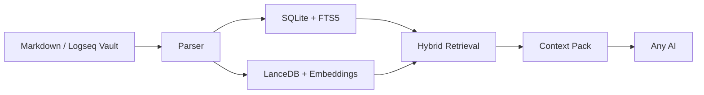

<div align="center">

# 🌌 OmniClip RAG

**A silent gravity field between your private notes and the universe of AI.**

[](CHANGELOG.md) [](#-quick-start) [](pyproject.toml) [](#-core-philosophy) [](https://github.com/msjsc001/OmniClip-RAG/releases) [](README.zh-CN.md) [](LICENSE)

[中文说明](README.zh-CN.md) | [Changelog](CHANGELOG.md) | [Architecture](ARCHITECTURE.md)

</div>

<br/>

 **What is it?** It is a local Markdown semantic search software and a local RAG knowledge base. (V0.3.3 **already supports semantic retrieval for 1290 formats**)
 **How to use it?** Just open the application, input your Markdown notes path, and click "Build Knowledge Base" to set up your local RAG vault. Once built, you can use it to semantically search your notes. The retrieved content can be copied and sent to any AI for in-depth discussion, or used for your own deep reading.
 **What are the benefits?** No need to upload any of your data, and no vendor lock-in. It requires no complex configuration or setup. Moreover, it features hot-reloading—newly written notes automatically enter the RAG vault! New notes can also be an organized collection of your historical conversations with AIs, which in turn implicitly provides a permanent memory for them.

> **Introduction: Handing Over Our "Cyber-Underwear" in the AI Era!**
> **OmniClip RAG uniquely achieves the impossible: You can have it all!**
>
> **We Demand**: Our Markdown notes remain completely ours.
> **We Also Demand**: Any AI to deeply participate within our permitted and supervised scope. The note vault and the AI must be deeply decoupled yet highly interactive.
> **And We Demand**: An out-of-the-box experience without any tedious setup, featuring a robust hot-reload capability so new notes automatically enter the RAG semantic pool! It can even compile your historical AI conversations, granting your LLMs a permanent, rolling memory.

> In the AI era, the more we rely on large models, the more personal privacy we surrender. Most knowledge base RAG tools on the market are either agonizingly complex to configure (involving server-like Docker or Python environments), demand a steep learning curve that costs too much time, forcibly tether you to a bloated chat interface, or require you to upload your notes completely. They all attempt to lock your data into their products, making it impossible for you to ever leave them.

> To ensure my notes and thoughts genuinely remain mine, I spent considerable time thinking through and comparing numerous possibilities before finalizing and hand-crafting this pure local semantic retrieval tool—**OmniClip RAG**. I pushed its core functionalities to the absolute limit, ensuring that it **both** runs smoothly on most computers **and** maintains professional-grade capabilities. It functions as a local knowledge firewall, allowing you to selectively let AI deeply read your "second brain" without worrying about your data being hijacked by any cloud or local software.


<br/>

<div align="center">
  
</div>

<br/>

## 🎯 Core Philosophy & Priceless Boundaries

**OmniClip RAG** is a radically decoupled "privacy firewall" and "manual-transfer local RAG search engine" meticulously crafted for the Markdown note ecosystem (natively compatible with Logseq, Obsidian, Typora, MarkText, Zettlr, and any plain text application).

It exclusively performs one highly refined task: it semantic-searches tens of thousands of pages locally via embedded vector algorithms (e.g., `BAAI/bge-m3`) and structural indexing, meticulously packs the most high-value contextual snippets, and lets you **manually clip and paste them into any external top-tier AI** (such as ChatGPT, Claude, Kimi, etc.) for profound interactions. In short: As long as your materials are in Markdown formats, this engine acts as the ultimate "second brain permanent memory extractor."

**Why Was It Built This Way? (Core Philosophy)**

- **Absolute Privacy Isolation**: External AIs can *only* leverage the contextual fragments you explicitly bundle and offer via the semantic engine under your supervision. They have zero access to the rest of your vault. Your absolute data sovereignty is inviolable here.
- **A Highly Decoupled "Brain-Machine Interface"**: It binds to no single AI chat UI. If Claude handles complex code better today, you clip content to Claude. If GPT-5 transforms logic modeling tomorrow, you feed the same snippet there. This ensures physical independence between the tool and note content, freeing you from setup locking and platform binding.
- **Pursuing the "Strong Lindy Effect"**: I hope this serves as a memory lighthouse that won't become obsolete in the distant future. As long as the concept of plain text and Markdown persists, you will be able to summon faded historical insights you’ve personally forgotten, powered tightly by this clean and lightweight engine.

---

## 🚀 Quick Start & Workflow

OmniClip perfectly integrates smoothly into your workflow:
1. Continue writing quietly in your local Markdown vault for extended periods.
2. Double click the OmniClip app—it will transparently and silently maintain a mixed-search index of your vault.
3. When searching for insights, punch in keywords or short sentences. OmniClip will extract and assemble unparalleled fragments in a single click.
4. Paste that rich context bundle directly into the smartest AI model available at the moment.

### First-Time Use Guide

The foundation is built as a single portable green EXE. No complicated scripting or dev environments are needed. Just pure **"Download, double-click, and run"**:

1. Launch the desktop app interface.
2. Select the root folder of your note vault.
3. Confirm the data directory (OmniClip refuses to soil or modify your raw notes).
4. *(First run)* Initiate the **space-and-time precheck** to estimate load constraints.
5. *(First run)* Start a **one-click model bootstrap (downloads and caches the local model)**.
6. Finally, trigger a **Full Build** (index once, run forever via hot reload tracking).
7. **Once built, start searching!** Find brilliant slices, click to copy snippets, and send them to your favorite LLMs.

<div align="center">
  
</div>

### 💡 Appendix: Recommended Prompt for AI

When pasting your retrieved context packs to an AI, you may want the AI to utilize the knowledge effectively without just "summarizing" or "parroting" your notes. We highly recommend including the following guidelines in your System Prompt or initial message to the AI:

```text
- In our conversation, I may sometimes include RAG semantic retrieval snippets (not the full text) related to the topic as background information for our discussion.
	- This information comes from my local RAG retrieval software, which searches all relevant snippets within my local note vault. This allows me to establish a deep, critical connection between you and my knowledge base, without the time and effort of uploading the entire vault, thus maximizing the privacy of my notes while enabling in-depth interaction.
	- The sole purpose of providing these snippets is to synchronize you with my knowledge boundaries and make our conversation deeper and more meaningful.
		- Some of the snippets I provide may be irrelevant; please ignore this noise on your own.
		- Please directly treat these snippets as known premises and converse with me based on them. Absolutely do not summarize, simply agree with, parrot back, or distill this background information.
		- When you find it necessary, or when your reply is inspired by a specific snippet:
			- Please naturally mention the relevant note title and paragraph so I can accurately locate it locally (this also helps me with subsequent additions, deletions, or modifications to my local notes).
	- During your reasoning and our conversation, you can ask me to provide supplemental information at any time if needed.
		- If you need specific support, please explicitly tell me the exact words or phrases to search for. I will use those to retrieve the key snippets and return them to you.
		- If you find that key content is truncated when reviewing a snippet, you can directly ask me to provide the complete note page.
```

---

## ✨ Core Features

OmniClip is intentionally not trying to win with flashy UI tricks. The real work went into making local knowledge retrieval dependable, explainable, and maintainable without forcing users into cloud upload or environment chaos.

- **Local-first by default**: indexes, logs, caches, and runtime payloads are managed under `%APPDATA%\\OmniClip RAG` instead of polluting your source notes or requiring a cloud round-trip.
- **Deep Markdown / Logseq understanding**: beyond plain Markdown, the parser understands Logseq-style page properties, block properties, block refs, embeds, and hierarchy, so retrieval stays closer to how you actually think and write.
- **Real hybrid retrieval**: this is not a basic keyword finder. OmniClip combines `SQLite + FTS5 + structure-aware scoring + LanceDB vector search` so it can catch both exact terms and semantically related ideas.
- **Physically isolated extension formats**: Markdown, PDF, and Tika-backed formats keep separate indexes and states, then meet again through a broker layer that returns unified results with explicit source labels.
- **Large Tika format exposure**: the current picker exposes `1290` extension formats with clear risk tiers for recommended, unknown, untested, and poor-compatibility items.
- **Lean packaged app, external Runtime**: the EXE stays lightweight while Runtime components are managed separately, with shared AppData installation, legacy-runtime reuse, and component-level repair/cleanup.
- **Build flows that explain themselves**: preflight, rebuild, incremental watch, extension indexing, and Tika auto-install are designed to surface stage, progress, and failure reasons instead of leaving users staring at a frozen screen.
- **Traceable query results**: results carry source labels, page/format identity, score hints, and state messaging so users can understand why something was returned instead of trusting a black box.
- **Degrade before crashing**: damaged files, empty files, offline paths, extreme document size, missing runtime pieces, and GPU pressure are all handled with skip/isolation/retry/fallback strategies wherever possible.

<div align="center">
  
  
</div>

---

## 🔄 V0.3.3 Key Updates

`v0.3.3` continues the `0.3.x` stabilization line by turning the Tika route from "it exposes many formats" into "the formats you select are much more likely to index successfully", while also making Tika installation observable from the page itself.

- 🧩 **Tika indexing is now compatibility-first**: instead of requiring XHTML as the only valid success surface, the app now prefers `text/plain` and falls back to `rmeta/json`, which makes EPUB-style formats far less likely to fail with opaque `HTTP 406` errors.
- 🧾 **Tika build results are now easier to interpret**: the app distinguishes expected skips from real parser failures. A zero-byte file is reported as an empty-file skip instead of making users think Tika cannot handle that format.
- ⏳ **Tika auto-install finally shows inline progress**: the page now surfaces stage, current item, percentage, byte progress, and install target instead of giving users only a start/end black box.
- 📚 **Docs now match the current product shape**: README, changelog, architecture notes, and the new Tika closure plan all record the current compatibility-first direction, so future work no longer depends on chat history.

---

## 🧠 Minimalist & Restrained Architecture



### 🗄️ Surgical Data Storage Isolation

**Everything you own strictly stays in designated bounds.**
By default, data generation sits securely in `%APPDATA%\OmniClip RAG`. Under prohibitive permissions or system limits, it downgrades gracefully to `%LOCALAPPDATA%\OmniClip RAG`.
—— **It heavily repudiates creating messy temp logs or intrusive directories inside system installs or directly littering your precious note vaults.**

External heavy runtime payloads (e.g., native Torch environments) stay outside the packaged EXE and are now designed to converge into a shared AppData sidecar root after user-authorized installation (see [RUNTIME_SETUP.md](RUNTIME_SETUP.md)). Lean releases remain clean, while healthy legacy runtimes can still be reused across packaged version folders.

---

## 💻 Geek & Developer Entry Points

OmniClip is completely open-sourced on GitHub. Whether you're interested in the code repository, demand high standards for personal data sovereignty, or your note vault is simply too vast to traverse natively, you can dive deeply into its control at any time.

Currently, all source code and distribution packages have survived rigorous unit testing and smoke protocols:

**Start the Desktop GUI:**
```powershell
.\scripts\run_gui.ps1
```

**Build the Packaged Windows EXE:**
```powershell
.\scripts\build_exe.ps1
```

**For Automation and Terminal Devs, the native CLI is still on active duty:**
```powershell
.\scripts\run.ps1 status
.\scripts\run.ps1 query "your question"
```

---

## 📁 Documentation Hub

- [Chinese README](README.zh-CN.md)
- [Architecture Notes](ARCHITECTURE.md)
- [Changelog](CHANGELOG.md)
- [Storage Precheck Notes](STORAGE_PRECHECK.md)
- [Runtime Setup](RUNTIME_SETUP.md)
- [Markdown Query & Runtime RCA Plan](plans/Markdown主查询与Runtime稳定性RCA计划.md)
- [GPU Runtime & Extension Build UX Finish Plan](plans/GPU Runtime与扩展建库UX收尾计划.md)
- [Extension Format Isolation Plan](plans/扩展格式隔离子系统实施计划.md)
- [Runtime Cross-Version Stabilization & Tika Full-Catalog Closure Plan](plans/Runtime跨版本稳定化与Tika全量格式闭环计划.md)
- [Tika Build Stability & Install Progress Closure Plan](plans/Tika建库稳定性与安装进度闭环计划.md)
- [Retrieval Optimization Plan](plans/检索优化计划.md)
- [Build Performance Plan](plans/建库性能优化计划.md)

*(See Releases page for historical version update notes from V0.1.0 to the present).*

---

## 🙏 Open Source Thanks

OmniClip stands on a serious amount of open-source work. The core projects that are directly integrated, explicitly relied on, or used in build/test flows today include:

- **Python** for the main application/runtime foundation
- **Qt / PySide6 / Shiboken6** for the desktop GUI
- **SQLite** for authoritative local metadata, FTS, and state storage
- **LanceDB** for local vector retrieval storage
- **Apache Arrow / PyArrow** for table/vector data plumbing
- **PyTorch** for local model execution on CPU / CUDA
- **sentence-transformers** for embedding and cross-encoder integration
- **Transformers / Hugging Face Hub** for model loading and cache orchestration
- **BAAI/bge-m3** for the main embedding route
- **BAAI/bge-reranker-v2-m3** for the optional reranker route
- **PyPDF** for the dedicated PDF parsing path
- **Apache Tika** for the extension-format sidecar parsing route
- **Eclipse Temurin / Adoptium** for JRE distribution used by the Tika runtime path
- **watchdog** for filesystem watch support
- **PyInstaller** for Windows portable packaging
- **pytest** for automated regression coverage

Thanks to these projects and their maintainers for the long-term engineering work that makes a tool like this possible.

## 📜 License

This project is released under the [MIT License](LICENSE).

---

> ⚠️ **Disclaimer** ⚠️
> 
> OmniClip RAG / 方寸引 is provided on an "as is" and "as available" basis, without warranties of any kind, whether express or implied, including but not limited to merchantability, fitness for a particular purpose, non-infringement, uninterrupted operation, or error-free behavior.
> 
> **You are solely responsible for:**
> - verifying all retrieval results, exported context packs, and AI-generated outputs before relying on them
> - maintaining backups of your notes, databases, models, and exported materials
> - reviewing the legality, sensitivity, and sharing scope of any data you index or paste into third-party AI tools
> - complying with the licenses, terms, and usage restrictions of third-party models, libraries, datasets, and services used with this project
> 
> OmniClip RAG may return incomplete, outdated, misleading, or incorrect results. Any downstream AI may also hallucinate, misinterpret, overgeneralize, or fabricate conclusions even when the retrieved context is accurate. This project is not a substitute for professional judgment, internal review, or independent verification.
> 
> **Do not use OmniClip RAG or any exported context pack as the sole basis for medical, legal, financial, compliance, safety-critical, security-critical, employment, academic misconduct, or other high-stakes decisions.**
> 
> The maintainers and contributors are not liable for any direct, indirect, incidental, consequential, special, exemplary, or punitive damages, or for any data loss, downtime, model misuse, privacy incident, operational interruption, or decision made based on the use or misuse of this project, to the maximum extent permitted by applicable law.
> 
> All third-party product names, model names, platforms, and trademarks mentioned in this repository remain the property of their respective owners. Their appearance here does not imply affiliation, endorsement, certification, or partnership.

<br/>

<div align="center">
  <b>Infinite insights within a bounded space.</b>
</div>

