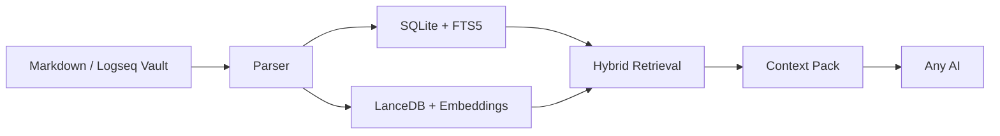

# OmniClip RAG

[](CHANGELOG.md)
[](#quick-start)
[](pyproject.toml)
[](#why)
[](README.zh-CN.md)
[](LICENSE)

**OmniClip RAG** is a local-first desktop RAG for local Markdown note libraries such as Typora, Logseq, and Obsidian vaults.

**方寸引** is the Chinese product name. It frames the app as a compact local layer that precisely pulls the right notes toward whatever AI you choose next.

Its core purpose is to turn your local notes into an independent, hot-reloadable, supervised **manual RAG layer**. You retrieve context locally first, decide what to reveal, and then hand that context to any AI you want. That keeps your note system highly decoupled from any single AI product while still allowing deep interaction between your notes and external AI tools. Even when you are not chatting with an AI, OmniClip RAG still works as a semantic search tool for your own knowledge base.

You search locally, inspect the results, and only copy the context you want to expose. The AI never needs blanket access to your vault.

> Future direction, time permitting: 1. gradually support more non-Markdown note systems and database-backed note tools; 2. provide an API or MCP bridge so AIs that need it can call the retrieval layer directly. In practice, if you keep saving your AI chats or other text material back into your note vault, OmniClip RAG also becomes a kind of ever-growing semantic memory index for your own workflow.

## Why

Most note-to-AI integrations are too tightly coupled. They either:

- force your notes into one product,
- expose too much context by default,
- or make incremental updates and cleanup unreliable.

OmniClip RAG takes the opposite approach:

- your notes stay local,
- your retrieval layer stays separate,
- any AI can consume the final context pack,
- and the vault remains under your control.


## What's New In v0.1.4

This patch release closes the next runtime gap found right after `v0.1.3`.

- Fixed the missing `_runtime_dependency_message()` path so runtime-missing errors no longer crash into a `NameError`.
- Clarified CUDA capability reporting: the app now distinguishes between “system CUDA exists” and “this lean package still needs its own runtime install”.
- Kept the main release lean while making runtime-missing guidance explicit and actionable.

## What It Does

- Parses both standard Markdown and Logseq-style Markdown
- Understands page properties, block properties, block refs, and block embeds
- Builds a hybrid retrieval stack with `SQLite + FTS5 + LanceDB`
- Supports local `BAAI/bge-m3` embeddings
- Supports multiple vaults with isolated per-vault workspaces
- Performs preflight space and time estimation before model bootstrap or indexing
- Can resume or pause a full rebuild instead of forcing a restart
- Hot-reloads vault changes with incremental reindexing
- Exports ready-to-paste context packs for any AI tool
- Provides a desktop GUI as the primary workflow

## Architecture At A Glance



## Core Experience

1. Point OmniClip RAG to your vault.
2. Run a precheck for disk space and time.
3. Download or validate the local model.
4. Build the index.
5. Search from the desktop app.
6. Review pages, semantic anchors, and snippets.
7. Copy the generated context pack into any AI chat or writing tool.

## Desktop-First Workflow

The primary entry point is the GUI:

```powershell
.\scripts\run_gui.ps1
```

The Windows build script creates a desktop executable:

```powershell
.\scripts\build_exe.ps1
```

Default output:

```text
dist\OmniClipRAG\OmniClipRAG.exe
```

CLI is still available for debugging and automation:

```powershell
.\scripts\run.ps1 status
.\scripts\run.ps1 query "boundary and tolerance"
```

## Quick Start

1. Launch the GUI.
2. Choose your vault directory.
3. Confirm the data directory.
4. Run **Precheck space/time**.
5. Run **Download model** once, or point the app at a manually downloaded local model.
6. Run **Build index**.
7. Search and copy your context pack.

## Model And Storage Notes

Current stable default:

- Vector backend: `LanceDB`
- Embedding model: `BAAI/bge-m3`
- Runtime: `torch`
- Device: `auto` by default, which resolves to `cuda` when the local PyTorch runtime really supports NVIDIA acceleration and falls back to `cpu` otherwise

For a first local run on Windows, plan for at least **8 GB to 10 GB** of free space.

OmniClip RAG estimates:

- SQLite metadata size
- FTS size
- vector index size
- model cache size
- temporary peak usage
- safety margin
- first full-build time
- first model-download time

before starting model bootstrap or indexing.

See [STORAGE_PRECHECK.md](STORAGE_PRECHECK.md) for details.


The official Windows release is now intentionally a lean app package:

- it does **not** bundle model files,
- it does **not** bundle very large optional AI runtimes such as `torch`, `sentence-transformers`, or `onnxruntime`,
- and users install heavy runtime components separately only when they actually need them.

See [RUNTIME_SETUP.md](RUNTIME_SETUP.md) for the packaged-app runtime flow.

## Data Directory

By default, user data goes to `%APPDATA%\OmniClip RAG`.
If that location is not writable in the current environment, the app falls back to a writable local directory automatically.

Current layout:

```text
OmniClip RAG/
  config.json
  shared/
    cache/
      models/
    logs/
  workspaces/
    <workspace-id>/
      state/
        omniclip.sqlite3
        lancedb/
        rebuild_state.json
      exports/
```

Design rule:

- `shared/` stores cross-vault assets such as model cache and general logs
- `workspaces/<workspace-id>/` stores only vault-specific data such as SQLite state, LanceDB state, exports, and unfinished-build state

This means reinstalling the app does **not** force a model re-download as long as you keep the same data directory.

## Project Structure

```text
omniclip_rag/
  config.py
  parser.py
  storage.py
  preflight.py
  vector_index.py
  service.py
  gui.py
  __main__.py
scripts/
  run.ps1
  run_gui.ps1
  build_exe.ps1
tests/
```

## Current Status

`V0.1.4` is the current public desktop update of the core product shape.

What is already solid:

- local parsing,
- local indexing,
- hybrid retrieval,
- desktop interaction,
- hot reload,
- context export,
- resumable rebuilds,
- pausable full rebuilds,
- multi-vault workspace isolation.

What is intentionally deferred:

- reranker integration,
- tray mode and global hotkeys,
- deeper settings panels,
- a smaller ONNX-first production path.

## Validation

The current tree has already been validated with:

- automated unit tests,
- real sample indexing,
- GUI startup verification,
- EXE build verification,
- EXE startup smoke verification,
- CLI query verification.

## Documentation

- [Chinese README](README.zh-CN.md)
- [Architecture Notes](ARCHITECTURE.md)
- [Changelog](CHANGELOG.md)
- [Storage Precheck Notes](STORAGE_PRECHECK.md)
- [Runtime Setup](RUNTIME_SETUP.md)
- [Release Notes v0.1.4](releases/RELEASE_NOTES_v0.1.4.md)
- [Release Notes v0.1.3](releases/RELEASE_NOTES_v0.1.3.md)
- [Release Notes v0.1.2](releases/RELEASE_NOTES_v0.1.2.md)
- [Release Notes v0.1.1](releases/RELEASE_NOTES_v0.1.1.md)
- [Release Notes v0.1.0](releases/RELEASE_NOTES_v0.1.0.md)

## License

This project is released under the [MIT License](LICENSE).

## Project Positioning

OmniClip RAG is not trying to become another monolithic AI workspace.

It aims to be a **clean local knowledge interface layer**:

- strong separation,
- controllable exposure,
- fast retrieval,
- and compatibility with whatever AI tools you choose next.

## Disclaimer

OmniClip RAG is provided on an "as is" and "as available" basis, without warranties of any kind, whether express or implied, including but not limited to merchantability, fitness for a particular purpose, non-infringement, uninterrupted operation, or error-free behavior.

You are solely responsible for:

- verifying all retrieval results, exported context packs, and AI-generated outputs before relying on them;
- maintaining backups of your notes, databases, models, and exported materials;
- reviewing the legality, sensitivity, and sharing scope of any data you index or paste into third-party AI tools;
- complying with the licenses, terms, and usage restrictions of third-party models, libraries, datasets, and services used with this project.

OmniClip RAG may return incomplete, outdated, misleading, or incorrect results. Any downstream AI may also hallucinate, misinterpret, overgeneralize, or fabricate conclusions even when the retrieved context is accurate. This project is not a substitute for professional judgment, internal review, or independent verification.

Do not use OmniClip RAG or any exported context pack as the sole basis for medical, legal, financial, compliance, safety-critical, security-critical, employment, academic misconduct, or other high-stakes decisions.

The maintainers and contributors are not liable for any direct, indirect, incidental, consequential, special, exemplary, or punitive damages, or for any data loss, downtime, model misuse, privacy incident, operational interruption, or decision made based on the use or misuse of this project, to the maximum extent permitted by applicable law.

All third-party product names, model names, platforms, and trademarks mentioned in this repository remain the property of their respective owners. Their appearance here does not imply affiliation, endorsement, certification, or partnership.
