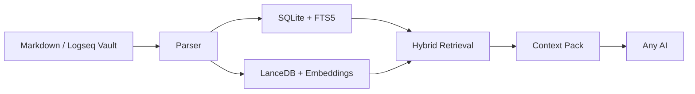

# OmniClip RAG

[](CHANGELOG.md)
[](#quick-start)
[](pyproject.toml)
[](#core-positioning)
[](https://github.com/msjsc001/OmniClip-RAG/releases)
[](README.zh-CN.md)
[](LICENSE)

[中文说明](README.zh-CN.md)

**方寸引** is the Chinese product name of `OmniClip RAG`. It suggests "drawing countless pages from within a small space", emphasizing a compact local retrieval layer that can precisely pull the right notes toward any AI you choose next.

The more we rely on large models, the more personal context and private knowledge we hand over. I built **OmniClip RAG / 方寸引** as a local tool to keep that boundary under my own control. It behaves like a firewall between your note system and external AI tools: you can let AI read deeply into your second brain, but only through the context you intentionally retrieve and copy out. (The product is still being refined, so the current experience is usable but not fully polished yet.)

Its core purpose is to turn a local Markdown note library, such as Typora, Logseq, or Obsidian, into an independent, hot-reloadable, supervised **manual local RAG layer**. You retrieve locally first, then manually provide only the relevant context to any AI you want. That keeps your note system highly decoupled from any single AI product while still enabling deep interaction between your notes and AI. Even when you are not chatting with an AI, OmniClip RAG is still a semantic search tool for your own knowledge base.

You search locally first, review the results, and then copy only the context you are willing to reveal. Your notes still belong to you, not to a chat product.

> Future direction, time permitting: 1. gradually support more non-Markdown note systems and database-backed note tools; 2. provide an API or MCP bridge so AIs that need it can call the retrieval layer directly. In practice, if you keep saving your AI chats or other text material back into your note vault, OmniClip RAG also becomes a kind of ever-growing semantic memory index for your own workflow.


## Core Positioning

OmniClip RAG fits a workflow like this:

1. You keep writing long-term knowledge in Logseq or any Markdown-based note library.
2. A local retrieval layer continuously maintains the index.
3. When needed, you package high-quality related pages, semantic paths, and relevant snippets.
4. You then paste that context pack into any AI.

This naturally emphasizes:

- local-first operation
- strong decoupling
- hot reload
- controlled exposure
- no blanket vault access for AI

## What's New In v0.1.8
This release hardens live watch so local vault edge cases do not corrupt a still-valid index:
- Reworked incremental watch refresh into a parse-first swap, so temporarily unreadable Markdown files keep the previous indexed content alive.
- Unified polling and watchdog under the same snapshot-diff, file-stability, delete-confirmation, and manifest-reconcile flow.
- Added offline guard handling for missing/unmounted vault roots plus persisted watch repair state for dirty render/vector work.
- Surfaced watch offline / recovered / repaired / retry events in the desktop activity log.
## Current Capabilities

- Desktop GUI: configuration, precheck, model bootstrap, indexing, search, live watch, selective cleanup
- Dual parser: standard Markdown and Logseq Markdown
- Logseq semantics: page properties, block properties, `id:: UUID`, block refs, block embeds
- Hybrid retrieval: `SQLite + FTS5 + structural scoring + LanceDB`
- Local embedding model: `BAAI/bge-m3`
- Multi-vault support: shared common data plus isolated per-vault workspace data
- Space and time precheck: estimate disk usage and first-run duration before indexing
- Full rebuilds can be resumed and paused
- Context-pack export for use with any AI
- Single-character query guard: a one-character search such as `鞋` stays on lexical retrieval only, so vector recall does not pull noisy journal-like pages too early
- Relevance scoring: a visible `0-100` engineering score built from title/path/body lexical hits, FTS rank, LIKE hits, vector similarity, and anti-noise penalties

## Architecture At A Glance



## Entry Points

Desktop app:

```powershell
.\scripts\run_gui.ps1
```

Build the packaged Windows EXE:

```powershell
.\scripts\build_exe.ps1
```

CLI is still kept for debugging and automation:

```powershell
.\scripts\run.ps1 status
.\scripts\run.ps1 query "your question"
```

## Quick Start

1. Launch the desktop app.
2. Choose the root folder of your note vault.
3. Confirm the data directory.
4. Run the space-and-time precheck first.
5. Run model bootstrap, or place a manually downloaded model in the expected directory.
6. Run a full build.
7. Then search and copy the context pack.

## Data Directory

By default, user data goes to `%APPDATA%\OmniClip RAG`.
If that location is not writable, the app only tries `%LOCALAPPDATA%\OmniClip RAG` next. It never falls back to the program directory or repository working tree, which avoids mixing personal data or test indexes into source-control paths.

Current layout:

```text
OmniClip RAG/
  config.json
  shared/
    cache/
      models/
    logs/
  workspaces/
    <workspace-id>/
      state/
        omniclip.sqlite3
        lancedb/
        rebuild_state.json
      exports/
```

Design rule:

- `shared/` stores reusable cross-vault assets such as model cache and general logs
- `workspaces/<workspace-id>/` stores only vault-specific indexes, vector data, exports, and unfinished-build state

As long as you keep the same data directory, reinstalling the app usually does not force a model re-download.

The official Windows package is intentionally kept as a lean app package:

- it does **not** bundle model files
- it does **not** bundle very large optional AI runtimes such as `torch`, `sentence-transformers`, or `onnxruntime`
- only users who truly need local vector retrieval install the heavy runtime separately

See [RUNTIME_SETUP.md](RUNTIME_SETUP.md) for the packaged runtime flow.

## Current Version

- Version: `V0.1.8`
- Main delivery form: desktop GUI
- Current stable path: `torch + bge-m3`

This version continues to stabilize the "local knowledge retrieval layer + desktop interaction layer" instead of rushing into a bloated all-in-one AI platform.

## Project Structure

```text
omniclip_rag/
  config.py
  parser.py
  storage.py
  preflight.py
  vector_index.py
  service.py
  gui.py
  __main__.py
scripts/
  run.ps1
  run_gui.ps1
  build_exe.ps1
tests/
```

## Validation

The current tree has already been validated with:

- automated unit tests
- real sample indexing
- GUI startup verification
- EXE build verification
- EXE startup smoke verification
- CLI query verification

## Documentation

- [Chinese README](README.zh-CN.md)
- [Architecture Notes](ARCHITECTURE.md)
- [Changelog](CHANGELOG.md)
- [Storage Precheck Notes](STORAGE_PRECHECK.md)
- [Runtime Setup](RUNTIME_SETUP.md)
- [Release Notes v0.1.8](releases/RELEASE_NOTES_v0.1.8.md)
- [Release Notes v0.1.7](releases/RELEASE_NOTES_v0.1.7.md)
- [Release Notes v0.1.6](releases/RELEASE_NOTES_v0.1.6.md)
- [Release Notes v0.1.4](releases/RELEASE_NOTES_v0.1.4.md)
- [Release Notes v0.1.3](releases/RELEASE_NOTES_v0.1.3.md)
- [Release Notes v0.1.2](releases/RELEASE_NOTES_v0.1.2.md)
- [Release Notes v0.1.1](releases/RELEASE_NOTES_v0.1.1.md)
- [Release Notes v0.1.0](releases/RELEASE_NOTES_v0.1.0.md)

## License

This project is released under the [MIT License](LICENSE).

## Disclaimer

OmniClip RAG / 方寸引 is provided on an "as is" and "as available" basis, without warranties of any kind, whether express or implied, including but not limited to merchantability, fitness for a particular purpose, non-infringement, uninterrupted operation, or error-free behavior.

You are solely responsible for:

- verifying all retrieval results, exported context packs, and AI-generated outputs before relying on them
- maintaining backups of your notes, databases, models, and exported materials
- reviewing the legality, sensitivity, and sharing scope of any data you index or paste into third-party AI tools
- complying with the licenses, terms, and usage restrictions of third-party models, libraries, datasets, and services used with this project

OmniClip RAG may return incomplete, outdated, misleading, or incorrect results. Any downstream AI may also hallucinate, misinterpret, overgeneralize, or fabricate conclusions even when the retrieved context is accurate. This project is not a substitute for professional judgment, internal review, or independent verification.

Do not use OmniClip RAG or any exported context pack as the sole basis for medical, legal, financial, compliance, safety-critical, security-critical, employment, academic misconduct, or other high-stakes decisions.

The maintainers and contributors are not liable for any direct, indirect, incidental, consequential, special, exemplary, or punitive damages, or for any data loss, downtime, model misuse, privacy incident, operational interruption, or decision made based on the use or misuse of this project, to the maximum extent permitted by applicable law.

All third-party product names, model names, platforms, and trademarks mentioned in this repository remain the property of their respective owners. Their appearance here does not imply affiliation, endorsement, certification, or partnership.
