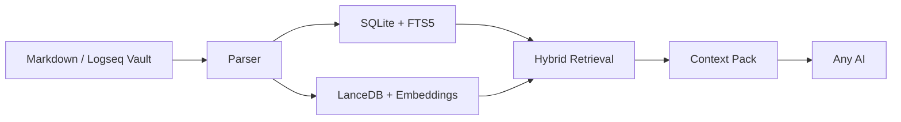

# OmniClip RAG

[](CHANGELOG.md)
[](#quick-start)
[](pyproject.toml)
[](#why)
[](README.zh-CN.md)

**OmniClip RAG** is a local-first desktop RAG for Markdown and Logseq vaults.

It is designed for one specific job: **bridge your notes to any AI without coupling your knowledge base to any single AI product**.

You search locally, inspect the results, and only copy the context you want to expose. The AI never needs blanket access to your vault.

## Why

Most note-to-AI integrations are too tightly coupled. They either:

- force your notes into one product,
- expose too much context by default,
- or make incremental updates and cleanup unreliable.

OmniClip RAG takes the opposite approach:

- your notes stay local,
- your retrieval layer stays separate,
- any AI can consume the final context pack,
- and the vault remains under your control.

## What It Does

- Parses both standard Markdown and Logseq-style Markdown
- Understands page properties, block properties, block refs, and block embeds
- Builds a hybrid retrieval stack with `SQLite + FTS5 + LanceDB`
- Supports local `BAAI/bge-m3` embeddings
- Performs preflight disk estimation before model bootstrap or indexing
- Hot-reloads vault changes with incremental reindexing
- Exports ready-to-paste context packs for any AI tool
- Provides a desktop GUI as the primary workflow

## Architecture At A Glance



## Core Experience

1. Point OmniClip RAG to your vault.
2. Run a preflight check.
3. Bootstrap the local model.
4. Build the index.
5. Search from the desktop app.
6. Review pages, semantic anchors, and snippets.
7. Copy the generated context pack into any AI chat or writing tool.

## Desktop-First Workflow

The primary entry point is the GUI:

```powershell
.\scripts\run_gui.ps1
```

The Windows build script creates a desktop executable:

```powershell
.\scripts\build_exe.ps1
```

Default output:

```text
dist\OmniClipRAG\OmniClipRAG.exe
```

CLI is still available for debugging and automation:

```powershell
.\scripts\run.ps1 status
.\scripts\run.ps1 query "boundary and tolerance"
```

## Quick Start

1. Launch the GUI.
2. Choose your vault directory.
3. Confirm the data directory.
4. Run **Preflight Check**.
5. Run **Bootstrap Model**.
6. Run **Rebuild Index**.
7. Search and copy your context pack.

## Model And Storage Notes

Current stable default:

- Vector backend: `LanceDB`
- Embedding model: `BAAI/bge-m3`
- Runtime: `torch`

For a first local run on Windows, plan for at least **8 GB to 10 GB** of free space.

OmniClip RAG estimates:

- SQLite metadata size
- FTS size
- vector index size
- model cache size
- temporary peak usage
- safety margin

before starting model bootstrap or indexing.

See [STORAGE_PRECHECK.md](STORAGE_PRECHECK.md) for details.

## Data Directory

By default, user data goes to `%APPDATA%\OmniClip RAG`.
If that location is not writable in the current environment, the app falls back to a writable local directory automatically.

Directory layout:

```text
OmniClip RAG/
  config.json
  state/
    omniclip.sqlite3
    lancedb/
  cache/
    models/
  logs/
  exports/
```

## Project Structure

```text
omniclip_rag/
  config.py
  parser.py
  storage.py
  preflight.py
  vector_index.py
  service.py
  gui.py
  __main__.py
scripts/
  run.ps1
  run_gui.ps1
  build_exe.ps1
tests/
```

## Current Status

`V0.1.0` is the first public release candidate of the core product shape.

What is already solid:

- local parsing,
- local indexing,
- hybrid retrieval,
- desktop interaction,
- hot reload,
- context export.

What is intentionally deferred:

- reranker integration,
- tray mode and global hotkeys,
- deeper settings panels,
- a smaller ONNX-first production path.

## Validation

The current tree has already been validated with:

- automated unit tests,
- real sample indexing,
- GUI startup verification,
- EXE build verification,
- CLI query verification.

## Documentation

- [Chinese README](README.zh-CN.md)
- [Architecture Notes](ARCHITECTURE.md)
- [Changelog](CHANGELOG.md)
- [Storage Precheck Notes](STORAGE_PRECHECK.md)

## Project Positioning

OmniClip RAG is not trying to become another monolithic AI workspace.

It aims to be a **clean local knowledge interface layer**:

- strong separation,
- controllable exposure,
- fast retrieval,
- and compatibility with whatever AI tools you choose next.
