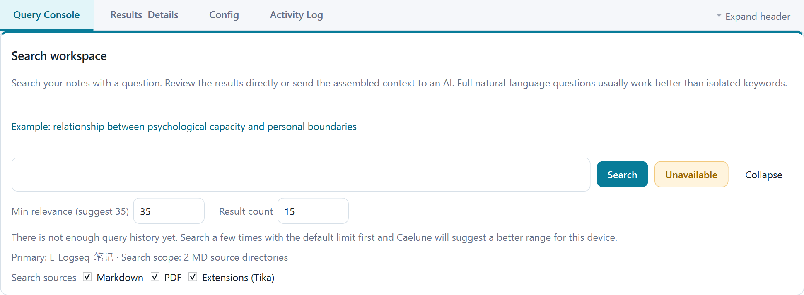
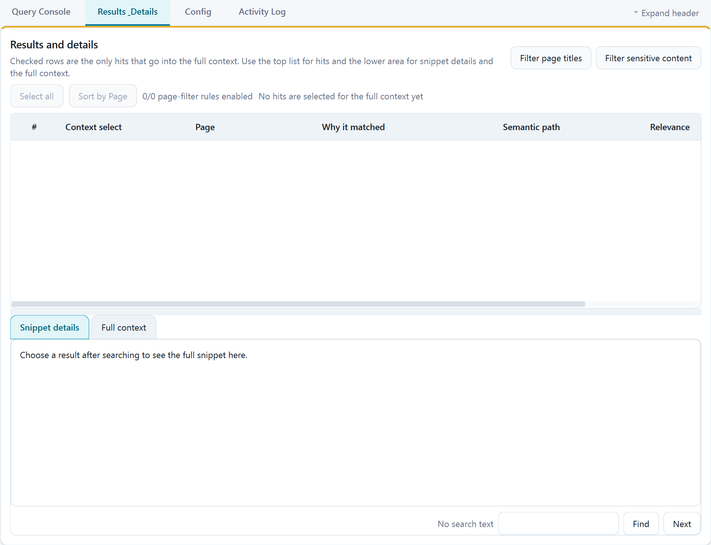
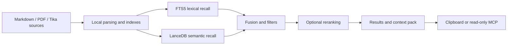

<div align="center">


# Caelune

**A local-first Windows desktop app and read-only MCP server for searching private Markdown, PDF, and Tika-backed knowledge bases.**

[](https://github.com/EllisMorrow/Caelune/releases/latest)
[](https://github.com/EllisMorrow/Caelune/releases/tag/v0.5.4)
[](https://github.com/EllisMorrow/Caelune/releases/latest)
[](#privacy-boundary)
[](https://github.com/EllisMorrow/Caelune/releases)
[](https://registry.modelcontextprotocol.io/v0/servers?search=io.github.EllisMorrow/caelune-mcp)
[](LICENSE)

[Download Windows app](https://github.com/EllisMorrow/Caelune/releases/latest) ·
[中文说明](README.zh-CN.md) ·
[Website](https://ellismorrow.github.io/Caelune/) ·
[User Wiki](https://github.com/EllisMorrow/Caelune/wiki) ·
[MCP Setup](MCP_SETUP.md)

</div>

## What Caelune does

Caelune builds searchable indexes from knowledge you already keep on your own computer. It combines exact-text retrieval, structural signals, semantic vector search, optional reranking, and source-aware context assembly.

The desktop app manages data roots, Runtime components, models, knowledge-base builds, live watch, queries, and result review. The optional MCP server exposes the same retrieval core to MCP-capable AI clients through two read-only tools.

<div align="center">
  
  <br />
  <sub>Search local Markdown, PDF, and other documents, review source-linked results directly, or provide selected evidence to AI.</sub>
</div>

### Choose your path

| I want to… | Start here |
| --- | --- |
| Install the Windows app and build my first index | [Getting Started](https://github.com/EllisMorrow/Caelune/wiki/Getting-Started) |
| Understand Runtime, models, CPU, CUDA, or resource messages | [Runtime and Models](https://github.com/EllisMorrow/Caelune/wiki/Runtime-and-Models) |
| Keep indexes current after editing notes | [Knowledge Bases and Live Watch](https://github.com/EllisMorrow/Caelune/wiki/Knowledge-Bases-and-Live-Watch) |
| Connect an AI client through MCP | [MCP Integration](https://github.com/EllisMorrow/Caelune/wiki/MCP-Integration) |
| Diagnose a problem safely | [Troubleshooting](https://github.com/EllisMorrow/Caelune/wiki/Troubleshooting) |

## Interface preview

The Query Console keeps input, scope, retrieval settings, and live query state together. Results and Details uses a separate page for source-labelled hits, snippet review, full-context selection, and page filtering.

<div align="center">
  <a href="docs/assets/readme-query-console-en.png">
    
  </a>
  <br />
  <sub>Query Console · click the image to open it at full size</sub>
</div>

<br />

<div align="center">
  <a href="docs/assets/readme-results-details-en.png">
    
  </a>
  <br />
  <sub>Results and Details · click the image to open it at full size</sub>
</div>

## Download

Open the [latest release](https://github.com/EllisMorrow/Caelune/releases/latest) and choose the package that matches your use case:

| Package label | Use it for |
| --- | --- |
| `WIN-EXE` | Normal Windows desktop use: configure, build, watch, search, and review results |
| `MCP-...-win64.zip` | Manual `stdio` setup for an MCP client |
| `.mcpb` | MCP Registry or MCPB-aware clients |

> The MCP package does not build or modify knowledge bases. Build the index with the Windows desktop app first.

## Highlights

- **Local-first storage** — indexes, configuration, models, logs, and Runtime payloads stay under the active local data root.
- **Markdown and Logseq awareness** — understands Markdown content plus common Logseq properties, block references, and embeds.
- **Hybrid retrieval** — combines SQLite FTS5, structure-aware scoring, LanceDB vector search, `BAAI/bge-m3`, and optional `BAAI/bge-reranker-v2-m3`.
- **PDF and Tika extensions** — maintains separate extension indexes and returns unified results with explicit source labels. The Tika catalog exposes 1,290 format entries; real compatibility still depends on the source file and parser.
- **Event-driven live watch** — reacts to real file changes, waits for the configurable quiet period, and performs incremental updates in disposable worker processes.
- **Visible query stages** — preparing, lexical recall, semantic recall, fusion, reranking, finalization, and context packing remain visible in the Query Console.
- **Resource-aware execution** — Auto mode prefers a usable NVIDIA CUDA path and falls back safely when Windows Commit, physical memory, or GPU memory is insufficient.
- **Read-only MCP access** — MCP clients can inspect readiness and search, but cannot build indexes, delete data, or change configuration.

## Privacy boundary

Caelune is local-first, not a promise that every possible workflow is permanently offline.

- Source files are read for indexing; normal build and source-removal operations do not delete or rewrite the original notes or documents.
- Network access is needed only for user-initiated downloads such as Runtime components, models, Java, or Tika.
- Retrieved text leaves the app only when you copy it, export it, or explicitly let an MCP client request it.
- Third-party AI clients and anything you paste into them remain subject to their own privacy policies.

Keep backups of important source material and review retrieved context before using it in high-stakes work.

## Quick start

1. Download the release asset whose name contains `WIN-EXE`.
2. Extract the archive and launch `Caelune.exe`.
3. Wait for the automatic Runtime detection to finish.
4. Choose the local data root and add one or more Markdown knowledge-base directories.
5. Install or repair the CPU/CUDA Runtime and local models from the Runtime page when prompted.
6. Run a full build once.
7. Search from the Query Console. Enable live watch if you want later edits to enter the index automatically.

Detailed instructions: [Getting Started](https://github.com/EllisMorrow/Caelune/wiki/Getting-Started).

## Practical requirements

- 64-bit Windows
- Enough disk space for the application, external Runtime, local models, and indexes
- Internet access for the initial Runtime/model downloads unless the payloads are installed manually
- CPU execution is supported; a compatible NVIDIA GPU and driver are optional
- Windows automatic paging-file management is recommended for large knowledge bases and local AI models

The Runtime and models are external sidecars so healthy components can be reused across application versions. See [Runtime and Models](https://github.com/EllisMorrow/Caelune/wiki/Runtime-and-Models).

## Retrieval flow


```mermaid
flowchart LR
    A["Markdown / PDF / Tika sources"] --> B["Local parsing and indexes"]
    B --> C["FTS5 lexical recall"]
    B --> D["LanceDB semantic recall"]
    C --> E["Fusion and filters"]
    D --> E
    E --> F["Optional reranking"]
    F --> G["Results and context pack"]
    G --> H["Clipboard or read-only MCP"]
```

## MCP in one minute

1. Build at least one knowledge base with the desktop app.
2. Download the MCP ZIP for manual `stdio` configuration, or use the Registry/MCPB package.
3. Point a compatible client at `Caelune-MCP.exe`.
4. Let the client call:
   - `omniclip.status` to inspect readiness and active retrieval mode
   - `omniclip.search` to retrieve source-labelled results

Some clients do not accept local `stdio` servers directly and may require a local proxy. See the [MCP Integration Wiki](https://github.com/EllisMorrow/Caelune/wiki/MCP-Integration) and [MCP_SETUP.md](MCP_SETUP.md).

## Documentation

### User guides

| Topic | Guide |
| --- | --- |
| Installation and first build | [Getting Started](https://github.com/EllisMorrow/Caelune/wiki/Getting-Started) |
| Runtime, models, CPU, and CUDA | [Runtime and Models](https://github.com/EllisMorrow/Caelune/wiki/Runtime-and-Models) |
| Knowledge bases and live watch | [Knowledge Bases and Live Watch](https://github.com/EllisMorrow/Caelune/wiki/Knowledge-Bases-and-Live-Watch) |
| Query stages and resource messages | [Search and Resources](https://github.com/EllisMorrow/Caelune/wiki/Search-and-Resources) |
| PDF and Tika sources | [PDF and Tika](https://github.com/EllisMorrow/Caelune/wiki/PDF-and-Tika) |
| MCP clients and tools | [MCP Integration](https://github.com/EllisMorrow/Caelune/wiki/MCP-Integration) |
| Common problems | [Troubleshooting](https://github.com/EllisMorrow/Caelune/wiki/Troubleshooting) |

### Project references

- [Architecture](ARCHITECTURE.md)
- [Runtime setup reference](RUNTIME_SETUP.md)
- [MCP setup reference](MCP_SETUP.md)
- [Changelog](CHANGELOG.md)
- [Third-party notices](THIRD_PARTY_NOTICES.md)
- [Release history](https://github.com/EllisMorrow/Caelune/releases)

## Development

```powershell
# Desktop GUI
.\scripts\run_gui.ps1

# CLI status and query
.\scripts\run.ps1 status
.\scripts\run.ps1 query "your question"

# Build Windows packages
.\scripts\build_exe.ps1

# MCP self-check from source
python launcher_mcp.py --mcp-selfcheck
```

Developer orientation and architecture links live in [Development and Architecture](https://github.com/EllisMorrow/Caelune/wiki/Development-and-Architecture).

## License and third-party software

Caelune is released under the [MIT License](LICENSE). It relies on open-source projects including PySide6, SQLite, LanceDB, Apache Arrow, PyTorch, sentence-transformers, Transformers, BGE models, PyPDF, Apache Tika, Eclipse Temurin, watchdog, PyInstaller, and the Model Context Protocol SDK.

See [THIRD_PARTY_NOTICES.md](THIRD_PARTY_NOTICES.md) for the repository-level legal and distribution notices.

> Caelune and its retrieval results are provided without warranty. Verify important results, maintain backups, and do not use retrieved context or downstream AI output as the sole basis for medical, legal, financial, safety-critical, or other high-stakes decisions.
