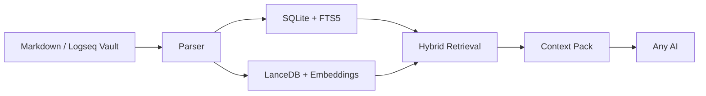

# 方寸引 / OmniClip RAG

[](CHANGELOG.md)
[](#首次使用建议)
[](pyproject.toml)
[](#核心定位)
[](README.md)
[](LICENSE)

[English README](README.md)

**方寸引** 是 `OmniClip RAG` 的中文名，取“方寸之间，牵引万卷”之意，强调在本地检索层中把你的笔记精准引向任意 AI。

在 AI 时代，我们越依赖大模型，交出的个人隐私就越多。为了让我的笔记和思想真正属于自己，我花时间手搓了这个本地工具“方寸引”。它像一个防火墙，让你可以毫无顾忌地让 AI 深度读取你的第二大脑，但不用担心数据被任何云端产品绑架。（它现在仍在持续打磨，所以当前版本已经能用，但还没有完全达到最顺手的状态。）

它的核心意义是把本地 Markdown 笔记库，例如 Typora、Logseq、Obsidian 的笔记库，做成一个独立、可热更新、可监督使用的**本地手动 RAG**（检索层）。我们先在本地检索，再把愿意提交给 AI 的上下文手动复制给任意 AI，也可以反过来让 AI 告诉我们还需要哪些本地上下文再去继续检索。这样就能在**笔记库和任意 AI 产品高度解耦分离的同时，还让 AI 和笔记内容进行深度交互**。同时，即使你暂时不用 AI 聊天，它自身也还是一个本地语义搜索工具。

你先在本地通过软件进行手动 RAG 检索，再把你愿意提交给 AI 的上下文手动复制给任意 AI。这样你的笔记仍然属于你自己，而不是属于某个聊天产品。

> 后续时间允许的话：1. 我会考虑逐步兼容到更多非 MD 格式笔记软件的 db 库；2. 推出 API 或 MCP，让需要的 AI 自行调用会更方便。理论上，如果你把与 AI 的聊天内容或任意文本持续保存到笔记库下，它也会逐渐变成一个无限扩展的语义记忆索引库。

## 核心定位

方寸引适合这样的工作流：

1. 长期在 Logseq 或任意 Markdown 笔记库里写东西。
2. 用本地检索层持续维护索引。
3. 在需要时，把高质量相关页面、语义路径、片段内容打包出来。
4. 再把这一包上下文贴给任意 AI。

这意味着它天然强调：

- 本地优先
- 高解耦
- 热更新
- 可控暴露面
- 不把整库直接交给 AI

## V0.1.6 重点更新

这一轮继续保持轻量发布包路线，同时把打包版运行时链路补齐：

- 修复了 `InstallRuntime.ps1` 的依赖安装顺序，避免先装好的 CUDA 版 `torch` 又被后续依赖覆盖成 CPU 版。
- 补上了打包版运行时引导元数据和启动时的路径恢复，让 EXE 更稳定地识别外部 `runtime/`。
- 构建脚本现在会保留本地 `runtime/` 目录，并在文档里进一步明确：GitHub 源码推送仍然不会提交大型运行时或构建产物。

## 当前能力

- 桌面 GUI：配置、预检、模型预热、建库、查询、热监听、分类清理
- 双解析器：普通 Markdown + Logseq Markdown
- Logseq 语义支持：页面属性、块属性、`id:: UUID`、块引用、块嵌入
- 混合检索：`SQLite + FTS5 + 结构打分 + LanceDB`
- 本地向量模型：`BAAI/bge-m3`
- 多笔记库支持：共享通用数据，笔记库级数据隔离
- 空间与时间预检查：在真正建库前先估算磁盘占用和首轮耗时
- 全量建库可恢复、可暂停
- 上下文包导出：给任意 AI 使用

## 架构一览



## 使用入口

桌面版：

```powershell
.\scripts
un_gui.ps1
```

打包 EXE：

```powershell
.\scriptsuild_exe.ps1
```

CLI 仍然保留，用于调试和自动化：

```powershell
.\scripts
un.ps1 status
.\scripts
un.ps1 query "你的问题"
```

## 首次使用建议

1. 打开桌面界面。
2. 选择笔记库根目录。
3. 确认数据目录。
4. 先跑空间时间预检。
5. 再做模型预热，或者把手动下载好的模型放到指定目录。
6. 再全量建库。
7. 然后开始查询并复制上下文。

## 数据目录

默认数据目录位于 `%APPDATA%\OmniClip RAG`。
如果当前环境对这个目录没有写权限，程序会自动回退到可写目录，避免直接启动失败。

当前目录结构：

```text
OmniClip RAG/
  config.json
  shared/
    cache/
      models/
    logs/
  workspaces/
    <workspace-id>/
      state/
        omniclip.sqlite3
        lancedb/
        rebuild_state.json
      exports/
```

含义是：

- `shared/` 放跨笔记库复用的模型缓存和通用日志。
- `workspaces/<workspace-id>/` 只放某个笔记库自己的索引、向量库、导出和未完成建库状态。

所以只要你保留同一个数据目录，重装软件后通常不需要重新下载模型。

正式发布包现在刻意保持为轻量主程序包：

- 不打包模型文件
- 不把 `torch`、`sentence-transformers`、`onnxruntime` 这类大型可选 AI 运行时直接塞进程序本体
- 只有当用户真的需要本地向量能力时，才单独安装运行时

打包版的运行时安装方式见 [RUNTIME_SETUP.md](RUNTIME_SETUP.md)。

## 当前版本说明

- 版本：`V0.1.6`
- 主交付形态：桌面 GUI
- 当前稳定主线：`torch + bge-m3`

这一版继续把“本地知识检索层 + 桌面交互层”做稳，不急着把它膨胀成一个庞杂的 AI 平台。

## 项目结构

```text
omniclip_rag/
  config.py
  parser.py
  storage.py
  preflight.py
  vector_index.py
  service.py
  gui.py
  __main__.py
scripts/
  run.ps1
  run_gui.ps1
  build_exe.ps1
tests/
```

## 验证情况

当前代码树已经做过这些验证：

- 自动化单元测试
- 样本笔记建库验证
- GUI 启动验证
- EXE 构建验证
- EXE 启动烟测
- CLI 查询验证

## 相关文档

- [English README](README.md)
- [架构说明](ARCHITECTURE.md)
- [更新日志](CHANGELOG.md)
- [空间预检说明](STORAGE_PRECHECK.md)
- [运行时安装说明](RUNTIME_SETUP.md)
- [v0.1.6 发布说明](releases/RELEASE_NOTES_v0.1.6.md)
- [v0.1.4 发布说明](releases/RELEASE_NOTES_v0.1.4.md)
- [v0.1.3 发布说明](releases/RELEASE_NOTES_v0.1.3.md)
- [v0.1.2 发布说明](releases/RELEASE_NOTES_v0.1.2.md)
- [v0.1.1 发布说明](releases/RELEASE_NOTES_v0.1.1.md)
- [v0.1.0 首发文案](releases/RELEASE_NOTES_v0.1.0.md)

## 许可证

本项目采用 [MIT License](LICENSE)。

## 免责声明

方寸引 / OmniClip RAG 以“按现状提供”和“按可用状态提供”为原则发布，不附带任何明示或默示担保，包括但不限于适销性、特定用途适用性、不侵权、持续可用性、无错误或无中断运行等担保。

你需要自行负责以下事项：

- 在依赖检索结果、导出的上下文包或下游 AI 输出前，进行独立核对与判断
- 自行做好笔记库、数据库、模型缓存和导出内容的备份
- 自行判断被索引、检索、复制到第三方 AI 工具中的数据是否涉及隐私、机密、合规或授权边界
- 自行遵守本项目所配套使用的第三方模型、库、数据集、服务及平台的许可证、使用条款与限制

方寸引可能返回不完整、过时、误导性或错误的结果；下游 AI 即使基于正确上下文，也仍可能出现幻觉、误读、过度推断或编造内容。本项目不能替代专业判断、正式审查流程或独立事实核验。

请不要将方寸引或其导出的上下文包，作为医疗、法律、金融、合规、安全关键、安防关键、招聘、学术诚信处理或其他高风险决策场景中的唯一依据。

在适用法律允许的最大范围内，项目维护者与贡献者不对任何直接、间接、附带、后果性、特殊、惩罚性损害承担责任，也不对因使用或误用本项目而导致的数据丢失、停机、模型误用、隐私事件、业务中断或决策后果承担责任。

本仓库中提及的所有第三方产品名、模型名、平台名与商标，均归其各自权利人所有；出现这些名称不代表本项目与其存在隶属、官方认可、认证或合作关系。
