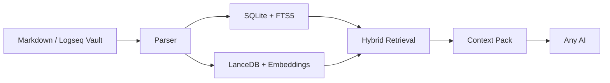

<div align="center">

# 🌌 方寸引 · OmniClip RAG

<p align="center"><strong>方寸之间，牵引万卷。你的私人笔记与满天繁星（AI）之间的静默引力场。</strong></p>
<p align="center">（V0.3.3版后支持1290种格式，V0.4.1版开始提供 MCP Registry / MCPB 发布线）</p>


<br/>

[](CHANGELOG.md) [](#-快速上手与工作流) [](pyproject.toml) [](#-核心理念与无价边界) [](https://github.com/msjsc001/OmniClip-RAG/releases) [](https://registry.modelcontextprotocol.io/v0/servers?search=io.github.msjsc001/omniclip-rag-mcp) [](README.md) [](LICENSE)

[English README](README.md) | [更新日志](CHANGELOG.md) | [架构说明](ARCHITECTURE.md) | [MCP 接入说明](MCP_SETUP.md) | [官网](https://msjsc001.github.io/OmniClip-RAG/)

<br/>

<details>
<summary>📖 <b>目录 / Table of Contents</b> (点击展开)</summary>

- [引言与快速入口](#-mcp-快速入口)
- [核心理念与无价边界](#-核心理念与无价边界)
- [核心特性](#-核心特性)
- [快速上手与工作流](#-快速上手与工作流)
- [MCP 怎么用](#-mcp-怎么用)
- [高阶心智模型与终极工作流](#-高阶心智模型与终极工作流)
- [极简克制的系统架构](#-极简克制的系统架构)
- [极客与开发者入口点](#-极客与开发者入口点)
- [近期版本动态](#-近期重点版本回顾)
- [相关文档导航](#-相关文档导航)
- [开源致谢与许可证](#-开源致谢)

</details>

</div>

<br/>

> [!TIP]
> **MCP 快速入口**
>
> 如果你想把方寸引接到 Jan.ai、OpenClaw、Claude Desktop、Cursor 或其他支持 MCP 的客户端，请直接看 [MCP_SETUP.md](MCP_SETUP.md)。
> 从 `v0.4.3` 起，MCP 线在继续提供手动 ZIP 的同时，也已经把共享环境根、诚实降级提示、标准 MCPB 发布物和仓库内可复现构建链全部收紧到同一版发布面。

---

**它是什么？** 它是本地 Markdown 语义搜索软件、本地 RAG 知识库，并且现在具备只读的 MCP 检索接口。

**怎么用？** 你只需要打开程序输入你的 Markdown 笔记路径再点建库，就能搭建好你的本地 RAG 知识库，建库后你就可以用它来语义搜索你的笔记，搜索的内容你可以复制发给任意 AI 进行深度研讨，也可以供自己深度研读。

**好处是什么？** 无须把你的任何资料上传，也不会被任何软件捆绑，它无须任何复杂的配置，搭建，且它具备热更新能力，新笔记写入会自动进入RAG库！新笔记也可以是你和AI的历史对话整理，这样变相的为AI提供了永久记忆。

> [!NOTE]
> **引言：AI 时代，我们正在交出我们的“赛博底裤”！**
> 
> **方寸引(OC-RAG) 独创性的做到了 既要、又要、还要！**
> 
> - **既要**:我们的 Markdown 笔记还是我们自己的。
> - **又要**:任意 AI 在我们允许且可监督的范围深度参与其中，笔记库与AI深度解藕且又可深度交互。
> - **还要**:开箱即用，无任何繁琐步骤，且具备稳健的热更新能力，新笔记写入会自动进入RAG库！新笔记也可以是你和AI的历史对话整理，这样变相的为AI提供了永久记忆。
> 
> 在 AI 时代，我们越依赖大模型，交出的个人隐私就越多。市面上大多知识库RAG类工具，要么配置极为繁琐搞的像服务器 Docker、Python 环境搞半天，要么是一套复杂的课程要我们付出太多的时间成本，要么就是非得强行的捆绑一个臃肿的聊天界面，要么笔记就需要完全上传才能使用，都在试图把你的数据锁死在它的产品里，让你永远离不开它们。
> 
> 为了让我的笔记和思想真正属于自己，我花时间思考对比了大量的可能方案，最终确定下来，并手搓了这个纯本地的语义检索工具——**方寸引（OmniClip RAG）**，并把它的核心功能做了极致的强化，让它**既**能跑在大多电脑上的**又**同时也具备较专业的水准。它就像一道本地知识防火墙，让你可以有所保留地让 AI 深度读取你的“第二大脑”，又不用担心数据被任何云端或本地软件绑架。

<br/>

<div align="center">
  
</div>

<br/>

---

## 🎯 核心理念与无价边界

**方寸引** 是一个专为 Markdown 笔记生态打造的、极度解耦的“隐私防火墙”与“手动端本地 RAG 搜索引擎”（兼容 Logseq、Obsidian、Typora、MarkText、Zettlr 等任意纯文本层工具）。

它只做一件事：在本地基于强大语义向量引擎（`BAAI/bge-m3` 等）和结构化索引为你检索上万页笔记，把高质量的相关片段精美打包——让你手动复制给任意外部顶配级 AI（ChatGPT、Claude、Kimi 等）进行深度干涉研讨。换句话说，只要你的素材是 md 格式，这个引擎就可以视为你的万能“第二大脑永久记忆提取器”。

<details>
<summary><b>👉 点击查看：为什么我要做成这样？（核心设计理念）</b></summary>

<br/>

- **绝对的隐私隔离**：AI 工具只能通过你在本地监督下主动打包好并贴过去的信息作为锚点推理上下文。它们无权访问、更不能“云打包”你其余任何无关笔记历史。你的绝对隐私主权在此不可侵犯。
- **高解耦的“脑机接口”**：坚决不捆绑任何 AI 聊天界面。今天 Claude 代码能力强你粘给 Claude 调试，明天 GPT-5 大幅升级你抛给 GPT-5 润色。工具和笔记本身高度生发物理隔断，你不需要做任何额外配置绑定。
- **追逐“强林迪效应”**：我希望这是一座很久都不会过时的记忆灯塔。世界变幻再快，只要纯文本与 Markdown 格式不变，你就能随时凭借这套轻巧干净的检索引擎，捞起你甚至早已忘记的思想沉淀。

</details>

<br/>

---

## ✨ 核心特性

方寸引不靠花哨界面取胜，它真正下功夫的地方是：让你的本地资料在**不上传、不锁定、不折腾环境**的前提下，仍然能获得靠谱、可解释、可长期维护的语义检索能力。

<table width="100%">
  <tr>
    <td width="50%" valign="top">
      <ul>
        <li><b>本地优先，资料不出门</b>：默认把索引、日志、缓存和运行时都在 <code>%APPDATA%\OmniClip RAG</code> 一侧管理，不污染笔记库原文件，也不要求把资料上传云端。</li>
        <li><b>Markdown / Logseq 深度理解</b>：理解 Logseq 风格的页面属性、块属性、块引用和层级结构，检索结果更贴近真实上下文。</li>
        <li><b>真正可用的混合检索</b>：不是简单关键字搜索，而是把 <code>SQLite + FTS5 + 结构得分 + LanceDB</code> 组合，既能抓原词，也能抓语义。</li>
        <li><b>扩展格式物理隔离</b>：Markdown、PDF、Tika 扩展格式各自用独立索引运行，互不污染，再由统一层标注来源。</li>
        <li><b>查询结果可解释、可追踪</b>：结果带来源标签、相关性评分和最近状态提示，方便你判断“为什么命中它”，而非一堆黑盒。</li>
      </ul>
    </td>
    <td width="50%" valign="top">
      <ul>
        <li><b>Tika 全格式大目录暴露</b>：当前已支持 <b>1290</b> 种扩展格式；推荐、未知、未测试分层提示，方便按风险逐步启用。</li>
        <li><b>发布版轻量，Runtime 独立管理</b>：EXE 包不强塞极大体积 AI 运行栈；支持共享 AppData 根与跨版本复用组件。</li>
        <li><b>建库跑得稳，且讲清楚在做什么</b>：预检、全量建库、增量监听、自动安装等阶段都会给出进度和异常原因，拒绝盲等。</li>
        <li><b>出错时优先降级，不优先崩溃</b>：对坏文件、空文件、极端大文件、显存不足等情况都有隔离或重试策略，保证主进程可用。</li>
        <li><b>标准 MCP Server 接口</b>：<code>OmniClipRAG-MCP.exe</code> 把检索能力以只读 MCP 的方式暴露，支持 MCP 的 AI 获取极客接入。</li>
      </ul>
    </td>
  </tr>
</table>

<br/>

<div align="center">
  <table width="100%" border="0">
    <tr>
      <td width="50%" align="center">
        <br/>
        <em>⚙️ 运行配置与状态把控</em>
      </td>
      <td width="50%" align="center">
        <br/>
        <em>🌙 极其沉浸的深色工作模式</em>
      </td>
    </tr>
  </table>
</div>

<br/>

---

## 🚀 快速上手与工作流

方寸引适合这样的工作流：
1. 长期在本地的任意 Markdown 笔记库里写东西。
2. 双击打开“方寸引”，它会自动、静默地为你维护全库的混合索引。
3. 在需要时，输入关键字或短句，将极高价值的碎片组合一键组装带走。
4. 再把这一包上下文投喂给当前市面上最聪明的 AI。

### 首次使用建议

软件基础为单包绿色 EXE 结构，不需要配置长串环境代码或懂编程，属于纯粹的**“下载双击，开箱即用”**：

1. 打开桌面界面。
2. 选择你常用的笔记库根目录。
3. 确认数据存放目录（它绝不会修改污染你的笔记库原始文件）。
4. （首次运行）先跑一下**空间与时间预检**评估负载。
5. （首次运行）一键做**模型预热（自动提取模型缓存）**。
6. 最后点击**全量建库**（一次建库，终身受用，后续将由增量监听热更）。
7. **建库完成后，搜索吧！**找到惊艳的切片，点击复制片段发给各个当红的大模型。

<div align="center">
  
</div>

<br/>

---

## 🔌 MCP 怎么用

`OmniClip RAG MCP Server` 的作用，是把方寸引现有的本地检索能力，通过标准 MCP 协议提供给支持 MCP 的 AI 客户端使用。

你可以把它理解成：
- 桌面版 `OmniClipRAG.exe` 负责正常建库、维护和可视化使用
- `OmniClipRAG-MCP.exe` 负责安静地在后台给 AI 提供“只读搜索接口”

从 `v0.4.3` 开始，MCP 这条线会同时提供两种分发形态：
- `OmniClipRAG-MCP-v0.4.3-win64.zip`：给手动配置 `stdio` 的用户
- `omniclip-rag-mcp-win-x64-v0.4.3.mcpb`：给官方 MCP Registry 与支持 MCPB 的客户端

> [!CAUTION]
> **使用前要先做什么？**
> MCP 版只是给 AI 调用的无头接口，不负责建库。你**必须先用桌面版把你的知识库建好**。
> 平时建库、重建、维护索引，还是用桌面版完成。如果知识库还没建好，MCP 不会假装可用，而是会明确返回类似 `index_not_ready` 的提示。

<details>
<summary><b>🛠️ 展开查看：官方生态路线与传统手动接入指引</b></summary>

<br/>

### 官方生态路线（Registry / MCPB）

方寸引从 `v0.4.1` 起就保持一条面向官方 MCP Registry / MCPB 的标准发布线；后续支持官方 Registry / MCPB 安装流的标准客户端，可以优先走这条更贴近官方生态的接入方式。

- 如果客户端已经支持从 Registry 发现 MCP Server，请直接搜索或添加：
  - `io.github.msjsc001/omniclip-rag-mcp`
- 如果客户端支持官方 MCPB 安装流，请优先使用 Release 中的：
  - `omniclip-rag-mcp-win-x64-v0.4.3.mcpb`
- 更详细的官方发布线、MCPB 与 ZIP 的区别、以及不同客户端的接入说明，请直接看 [MCP_SETUP.md](MCP_SETUP.md)。

### 传统手动路线（Jan.ai / OpenClaw）

如果你下载的是 ZIP 手动包，或者客户端尚不支持官方 MCPB 格式，请使用下面这种传统的“绝对路径 + stdio”配置法。

#### Jan.ai 配置参考
在 Jan.ai 中，你可以按下面这样配置：
- `服务器名称`：`OmniClip RAG`
- `Transport Type`：选择 `STDIO`
- `命令`：填 `OmniClipRAG-MCP.exe` 的完整路径（如 `D:\...\OmniClipRAG-MCP.exe`）
- `参数`：留空
- `环境变量`：默认留空

#### OpenClaw 配置方式
修改 `%USERPROFILE%\.openclaw\openclaw.json`，在 `mcpServers` 中加入：
```json
{
  "mcpServers": {
    "omniclip-rag": {
      "transport": "stdio",
      "command": "D:\\软件编写\\OmniClip RAG\\dist\\OmniClipRAG-MCP-v0.4.3\\OmniClipRAG-MCP.exe",
      "args": []
    }
  }
}
```
保存后，重启 OpenClaw 或它的 gateway 进程，让配置重新加载。

### 接上后 AI 能做什么
MCP 第一版故意做得很克制，只开放两个只读工具：
- `omniclip.status`: 查看当前本地知识库是否就绪，告诉 AI 当前是在完整 `hybrid` 模式，还是降级成了 `lexical_only`。
- `omniclip.search`: 搜索你的本地知识库，返回带来源标签的结果（比如 `Markdown · xxx.md`、`PDF · xxx.pdf · 第 N 页`）。

### 你可以怎么和 AI 说
接入 MCP 后，不需要你自己手动调工具，通常直接自然语言说就行，例如：
- `请用 OmniClip 搜索我本地知识库里关于“项目路线图”的内容，并整理成要点。`
- `先调用 omniclip.status，告诉我我的本地知识库现在是否就绪。`
- `请只搜索 OmniClip 里的 PDF 结果，关键词是“attention mechanism”。`
- `请在 OmniClip 里找和“我的思维模型”相关的内容，并给我最相关的 5 条切片和来源。`

</details>

<br/>

---

## 💡 高阶心智模型与终极工作流

<details>
<summary><b>🔥 展开进阶心智：发掘方寸引最极致的玩法与 Prompt 提示词</b></summary>

<br/>

> [!IMPORTANT]
> **极客心智**：不要把方寸引当“另一个 AI 软件”，而要把它当成你和任意顶尖 AI 之间的**“本地知识路由器 / 证据分发器”**。AI 不仅仅是在陪你聊天，而是在**基于你的长期沉淀做推理**。

站在架构与知识管理的视角，我们强烈推荐以下几种能产生真实杠杆效应（Leverage）的高阶用法：

### 1. 跨模型认知套利流 (Cross-Model Cognitive Arbitrage)
将方寸引作为“单一事实来源（SSOT）”。既然 UI 物理隔离，你可以把同一份检索出的高浓度上下文包（Context Pack）**并行投喂**给不同的引擎：
让 Claude 3.5 Sonnet 基于切片写核心代码，同时让 O1 做边界漏洞推演，再推给专注长文本的模型写复盘报告。利用本地检索引擎的定力，对云端大模型进行“资源套利”，规避单一模型的思维盲区。

### 2. 被动式情报集散中心 & 证据层隔离
彻底榨干对 PDF 与 Tika（`1290` 种格式）的支持。把 Markdown 当成你的**“认知主链”（存放自己的理解与判断）**，把 PDF / EML / DOCX 等当成**“原始资料证据仓”**。
日常收集资料无需整理，只需扔进本地对应目录。需要查证时，有意识地区分：想看“我怎么想的”搜 Markdown；想看“证据怎么说”搜 PDF / Tika。通过 MCP 对 AI 说：*“检索最近一季度的研报证据，并与我的思考笔记交叉比对”*，你的电脑秒变离线私域参谋部。

### 3. 项目上下文压缩器与“影子脑暴”网络
针对复杂长线项目，把需求、方案、废弃草稿、会议记录全部沉淀。推进卡住时，不要自己翻找，立刻盲搜模糊的“判断句”或“冲突对”（如：`这个项目当初为什么这么定` 或 `开发效率 和 绝对隐私`）。
利用向量引擎的“模糊语义关联”，它可能把你两年前写的某段随笔与当下的项目架构匹配在一起，瞬间催生真正的“意外灵感（Serendipity）”，大幅降低“重复思考已经想过的东西”的内耗。

### 4. 自演化的“永久记忆海马体”与绝对隐私防火墙
遇到极其实用的棘手问题，让某个 AI 推演出绝佳方案后，立刻将其摘要为一份 Markdown 存入本地 Vault。毫秒级热重载机制会让它瞬间进入 LanceDB 和 FTS5 检索池。
未来，这等同于物理层面为任何接入的 AI 挂载了一个连续增量、私有且受完全监督的“永久记忆”。资料长期留本地，**你交出的只是“最小必要上下文”**，绝不上传金矿本身，实现最极致的隐私安全。

> 🌟 **终极建议**：写长文、深聊或重大决策前 —— **先搜，不先聊**。方寸引最强的用法，不是替你思考，而是把你已经思考过、看过、积累过的东西，以刚好够用的方式重新交还给你和当前的顶级 AI。

---

### 💬 附：与 AI 对话时的推荐提示词 (Prompt Injection)

当你把检索到的切片复制给 AI 时，为了让 AI 更好地理会你的意图并避免它仅仅是“复读”或“总结”你的笔记，我们推荐你在对话的系统提示词（System Prompt）或第一次前置对话中加入以下说明：

```text
- 在我们的对话里，我有时可能会放入与话题相关的RAG语义检索切片（非全文）作为我们的对话背景信息使用
	- 这些信息来源于我本地的RAG检索软件，它能检索我的本地笔记库所有相关切片内容，这样我就可以让你与我的知识库建立深度的关键连接，同时不用耗时耗力地上传整个笔记库，也能起到最大话保护笔记隐私的前提下进行深入交互。
	- 提供这些片段的唯一目的是让你同步我的知识边界，并使我们的对话更有深度和意义
		- 我给你的切片信息中可能有不相关的，请你自行忽略这些噪音
		- 请直接将这些切片作为已知前提，结合它们与我对话，绝对不要去总结、贴合、复读或提炼这些背景信息
		- 当你认为有必要，或回复受某个切片启发时
			- 请自然提及相关的笔记名和段落，方便我在本地精准定位（这也有助于我后续增删改本地笔记）
	- 你在推理和对话过程中，如果有需要可以随时提示我补充信息
		- 如果需要特定支撑，请直接提示我需要搜索的词句，我会通过任意词句获取关键切片并返回给你
		- 如果查看切片时发现关键内容被截断了，你可以直接叫我提供完整笔记页面
```

</details>

<br/>

---

## 🧠 极简克制的系统架构



### 🗄️ 干净的数据存储隔离

**一切个人资产，只属于特定边界。**
默认数据主要分配储在用户的 `%APPDATA%\OmniClip RAG` 原生目录下。如果因系统限制或权限不够，则回退保存在 `%LOCALAPPDATA%\OmniClip RAG`。
—— **它极其厌恶并断绝了一切会在系统安装根目录、甚至是你的知识库内直接抛撒冗余工作日志或建立污染文件的错误行径。**

所有高体积运行时依赖（如 Torch 相关栈）仍旧以外挂方式存在，不会被硬塞进 EXE；现在它们会优先收口到共享的 AppData runtime 根目录中（见 [RUNTIME_SETUP.md](RUNTIME_SETUP.md)），同时继续兼容旧版本 runtime 的跨版本复用，因此发布版既保持轻量，也不再要求版本一更新就整包重下。

<br/>

---

## 💻 极客与开发者入口点

方寸引已经在 GitHub 上完全开源。无论你对代码感兴趣，或者你也对个人数据主权存在高要求，或者由于笔记库已膨胀至传统编辑器自带搜索完全罢工，你随时可以深入把控它。

目前所有的源代码及分发包，都已经过了严酷的单元测试和冒烟截击：

<details>
<summary><b>💻 展开查看开发者构建与启动命令</b></summary>

<br/>

**启动桌面版：**
```powershell
.\scripts\run_gui.ps1
```

**执行核心 EXE 封装分发：**
```powershell
.\scripts\build_exe.ps1
```

**从源码运行 MCP 自检：**
```powershell
python launcher_mcp.py --mcp-selfcheck
```

**对于自动化命令和开发端，本程序原生的 CLI 接口仍在积极服役：**
```powershell
.\scripts\run.ps1 status
.\scripts\run.ps1 query "你的问题"
```

</details>

<br/>

---

## 🔄 近期重点版本回顾

<details>
<summary><b>📦 展开查看 V0.4+ 系列的核心演进（数据底座升级与 MCP 接入）</b></summary>

<br/>

### V0.4.3 重点更新
`v0.4.3` 的重点，是把最近这轮 hotfix 从“能跑”收口成“对用户说真话、对发布链也说真话”的正式版本：语义搜索状态不再伪装、模型下载真正跟随当前环境、MCP 与打包链重新回到仓库内可复现状态。
- 🧠 **语义检索状态终于诚实了**：如果 `vector_backend` 被关掉，或者当前库还没补建向量表，桌面端和 MCP 都会明确告诉你现在是词法降级态，而不是继续假装已经在跑完整混合检索。
- 📁 **模型 / 重排模型 / Runtime 的目标目录真正统一跟随当前环境根**：下载、修复、删除、日志、缓存都锁到当前 active data root，不再悄悄回落到默认 `%APPDATA%` 根。
- 🌏 **国内环境下的自动下载链更稳了**：现在优先 `ModelScope 国内源 -> HF 镜像 -> 官方源`，同时有终端实时输出、心跳日志和失败切换提示，不会再像黑箱一样一直停着。
- 🧭 **索引状态提示更能指导下一步操作**：配置页会区分“索引已就绪但只有词法检索”与“语义后端已启用但还没补建向量表”，让用户知道到底该重建什么。
- 🛠 **正式发布链补回仓库内闭环**：`OmniClipRAG-MCP.spec` 已重新纳入仓库，`GUI ZIP + MCP ZIP + MCPB` 三件套现在能从同一套源码版本直接重建。

### V0.4.2 重点更新
`v0.4.2` 的重点，是把最近完成的一系列“底层收口”真正落成用户可以感知的稳定产品行为：数据目录不再只是保存路径，而是当前环境的唯一根；GUI 在目录损坏时也能进入恢复壳；桌面端细节也同步收紧。
- 🗂 **数据目录升级为当前环境根目录**：配置、日志、缓存、模型、主 Runtime、Tika Runtime 与工作区状态，现在统一跟随当前激活的数据目录，不再让 GUI、Runtime、启动链各自猜真相。
- 🚧 **坏目录不再把用户挡在门外**：当前数据目录不可用时，GUI 会进入受限恢复模式，用人话告诉你发生了什么，并允许你重试或切换到另一个已保存环境。
- 🔁 **已保存数据目录真正变成环境切换器**：现在可以在多个环境根之间切换、清理坏路径列表，并通过受控重启稳定完成整套环境切换，而不是半热切换出一堆残留状态。
- 🧰 **桌面体验补齐一轮收口**：查询台支持紧凑折叠，配置页增加经典主题，图标链统一到新的应用图标，GUI 的可用性和一致性都比上一版更完整。
- 🌐 **官网已正式上线**：GitHub Pages 官网现在可以直接访问：[msjsc001.github.io/OmniClip-RAG](https://msjsc001.github.io/OmniClip-RAG/)

### V0.4.1 重点更新
`v0.4.1` 的重点，不是再造新的查询后端，而是把已经落地的 MCP 线真正收口成可被官方 MCP Registry 消费的标准发布物。
- 🚀 **MCP 官方发现路径正式转向 Registry**：仓库现在补上了正式 `server.json`，不再把已停止维护的 `modelcontextprotocol/servers` README 当成主战线。
- 📦 **新增标准 `.mcpb` 发布资产**：在原有手动 ZIP 之外，`omniclip-rag-mcp-win-x64-v0.4.1.mcpb` 成为面向 Registry 与 MCPB 客户端的标准分发形态。
- 🧭 **文档门面按“陌生开发者 30 秒看懂”收口**：英文 README 顶部补了 MCP Quickstart，中文 README 只做轻量引导而不打散原有叙事，`MCP_SETUP.md` 也明确解释了 `ZIP` 与 `.mcpb` 的区别。
- 🛠 **首次 Registry 发布刻意保持手动**：`0.4.1` 被保留为第一发 Registry 版本，用来验证 Release、哈希、元数据与 Registry 发布链路，后续再考虑自动化。

### V0.4.0 重点更新
`v0.4.0` 首次引入了独立的只读 MCP 壳与同一检索内核下的无头发布线：方寸引不再只是桌面软件，也开始具备可被外部 AI 客户端调用的标准 MCP Server 形态。

</details>

<br/>

---

## 📁 相关文档导航

- [English README](README.md) 
- [架构说明](ARCHITECTURE.md)
- [更新日志](CHANGELOG.md)
- [MCP 接入说明](MCP_SETUP.md)
- [OmniClip RAG 官方 MCP Registry 登月计划](plans/OmniClip%20RAG%20官方MCP%20Registry登月计划.md)
- [空间预检说明](STORAGE_PRECHECK.md)
- [运行时安装说明](RUNTIME_SETUP.md)
- [OmniClip RAG MCP 接入实施计划](plans/OmniClip RAG MCP接入实施计划.md)
- [Markdown 主查询与 Runtime 稳定性 RCA 计划](plans/Markdown主查询与Runtime稳定性RCA计划.md)
- [GPU Runtime 与扩展建库 UX 收尾计划](plans/GPU Runtime与扩展建库UX收尾计划.md)
- [扩展格式隔离子系统实施计划](plans/扩展格式隔离子系统实施计划.md)
- [Runtime 跨版本稳定化与 Tika 全量格式闭环计划](plans/Runtime跨版本稳定化与Tika全量格式闭环计划.md)
- [Tika 建库稳定性与安装进度闭环计划](plans/Tika建库稳定性与安装进度闭环计划.md)
- [检索优化计划](plans/检索优化计划.md) 
- [建库性能优化计划](plans/建库性能优化计划.md)

*(点击 Release 可查看自 V0.1.0 到新版本的详细特性演进历程)*

<br/>

---

## 🙏 开源致谢

方寸引今天能走到这里，离不开这些开源项目打下的地基。我们当前直接集成、明确依赖或用于构建/测试的核心开源项目包括：

> `Python`, `Qt / PySide6 / Shiboken6`, `SQLite`, `LanceDB`, `Apache Arrow / PyArrow`, `PyTorch`, `sentence-transformers`, `Transformers / Hugging Face Hub`, `BAAI/bge-m3`, `BAAI/bge-reranker-v2-m3`, `PyPDF`, `Apache Tika`, `Eclipse Temurin / Adoptium`, `watchdog`, `PyInstaller`, `pytest`, `ONNX Runtime`, `MCP Python SDK / Model Context Protocol`.
> 
> 感谢这些项目及其维护者长期的开放协作与工程投入。

## 📜 许可证

本项目采用 [MIT License](LICENSE)。

<br/>

<details>
<summary>⚠️ <b>点击查看 免责声明与协议限制 (Disclaimer)</b></summary>

<br/>

> [!WARNING]
> 方寸引 / OmniClip RAG 以“按现状提供”和“按可用状态提供”为原则发布，不附带任何明示或默示担保，包括但不限于适销性、特定用途适用性、不侵权、持续可用性、无错误或无中断运行等担保。
> 
> **你需要自行负责以下事项：**
> - 在依赖检索结果、导出的上下文包或下游 AI 输出前，进行独立核对与判断
> - 自行做好笔记库、数据库、模型缓存和导出内容的备份
> - 自行判断被索引、检索、复制到第三方 AI 工具中的数据是否涉及隐私、机密、合规或授权边界
> - 自行遵守本项目所配套使用的第三方模型、库、数据集、服务及平台的许可证、使用条款与限制
> 
> 方寸引可能返回不完整、过时、误导性或错误的结果；下游 AI 即使基于正确上下文，也仍可能出现幻觉、误读、过度推断或编造内容。本项目不能替代专业判断、正式审查流程或独立事实核验。
> 
> **请不要将方寸引或其导出的上下文包，作为医疗、法律、金融、合规、安全关键、安防关键、招聘、学术诚信处理或其他高风险决策场景中的唯一依据。**
> 
> 在适用法律允许的最大范围内，项目维护者与贡献者不对任何直接、间接、附带、后果性、特殊、惩罚性损害承担责任，也不对因使用或误用本项目而导致的数据丢失、停机、模型误用、隐私事件、业务中断或决策后果承担责任。
> 
> 本仓库中提及的所有第三方产品名、模型名、平台名与商标，均归其各自权利人所有；出现这些名称不代表本项目与其存在隶属、官方认可、认证或合作关系。

</details>

<br/>

<div align="center">
  <b>方寸之间 · 连接无穷</b>
</div>
