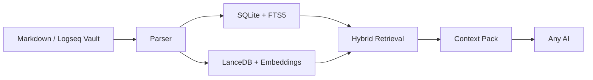

<div align="center">

# 🌌 方寸引 · OmniClip RAG

**方寸之间，牵引万卷。你的私人笔记与满天繁星（AI）之间的静默引力场。**

[](CHANGELOG.md) [](#-首次使用建议) [](pyproject.toml) [](#-核心理念与无价边界) [](https://github.com/msjsc001/OmniClip-RAG/releases) [](README.md) [](LICENSE)

[English README](README.md) | [更新日志](CHANGELOG.md) | [架构说明](ARCHITECTURE.md)

</div>

<br/>

 **引言：AI 时代，我们正在交出我们的“赛博底裤”！**
> **方寸引(OC-RAG) 独创性的做到了 既要、又要、还要！**
>
> **既要**:我们的 Markdown 笔记还是我们自己的。
> **又要**:任意 AI 在我们允许且可监督的范围深度参与其中，笔记库与AI深度解藕且又可深度交互。
> **还要**:开箱即用，无任何繁琐步骤，且具备稳健的热更新能力，新笔记写入会自动进入RAG库！新笔记也可以是你和AI的历史对话整理，这样变相的为AI提供了永久记忆。

> 在 AI 时代，我们越依赖大模型，交出的个人隐私就越多。市面上大多知识库RAG类工具，要么配置极为繁琐搞的像服务器 Docker、Python 环境搞半天，要么是一套复杂的课程要我们付出太多的时间成本，要么就是非得强行的捆绑一个臃肿的聊天界面，要么笔记就需要完全上传才能使用，都在试图把你的数据锁死在它的产品里，让你永远离不开它们。

> 为了让我的笔记和思想真正属于自己，我花时间思考对比了大量的可能方案，最终确定下来，并手搓了这个纯本地的语义检索工具——**方寸引（OmniClip RAG）**，并把它的核心功能做了极致的强化，让它**既**能跑在大多电脑上的**又**同时也具备较专业的水准。它就像一道本地知识防火墙，让你可以有所保留地让 AI 深度读取你的“第二大脑”，又不用担心数据被任何云端或本地软件绑架。


<br/>

<div align="center">
  
</div>

<br/>

## 🎯 核心理念与无价边界

**方寸引** 是一个专为 Markdown 笔记生态打造的、极度解耦的“隐私防火墙”与“手动端本地 RAG 搜索引擎”（兼容 Logseq、Obsidian、Typora、MarkText、Zettlr 等任意纯文本层工具）。

它只做一件事：在本地基于强大语义向量引擎（`BAAI/bge-m3` 等）和结构化索引为你检索上万页笔记，把高质量的相关片段精美打包——让你手动复制给任意外部顶配级 AI（ChatGPT、Claude、Kimi 等）进行深度干涉研讨。换句话说，只要你的素材是 md 格式，这个引擎就可以视为你的万能“第二大脑永久记忆提取器”。

**为什么我要做成这样？（核心设计理念）**

- **绝对的隐私隔离**：AI 工具只能通过你在本地监督下主动打包好并贴过去的信息作为锚点推理上下文。它们无权访问、更不能“云打包”你其余任何无关笔记历史。你的绝对隐私主权在此不可侵犯。
- **高解耦的“脑机接口”**：坚决不捆绑任何 AI 聊天界面。今天 Claude 代码能力强你粘给 Claude 调试，明天 GPT-5 大幅升级你抛给 GPT-5 润色。工具和笔记本身高度生发物理隔断，你不需要做任何额外配置绑定。
- **追逐“强林迪效应”**：我希望这是一座很久都不会过时的记忆灯塔。世界变幻再快，只要纯文本与 Markdown 格式不变，你就能随时凭借这套轻巧干净的检索引擎，捞起你甚至早已忘记的思想沉淀。

---

## 🚀 快速上手与工作流

方寸引适合这样的工作流：
1. 长期在本地的任意 Markdown 笔记库里写东西。
2. 双击打开“方寸引”，它会自动、静默地为你维护全库的混合索引。
3. 在需要时，输入关键字或短句，将极高价值的碎片组合一键组装带走。
4. 再把这一包上下文投喂给当前市面上最聪明的 AI。

### 首次使用建议

软件基础为单包绿色 EXE 结构，不需要配置长串环境代码或懂编程，属于纯粹的**“下载双击，开箱即用”**：

1. 打开桌面界面。
2. 选择你常用的笔记库根目录。
3. 确认数据存放目录（它绝不会修改污染你的笔记库原始文件）。
4. （首次运行）先跑一下**空间与时间预检**评估负载。
5. （首次运行）一键做**模型预热（自动提取模型缓存）**。
6. 最后点击**全量建库**（一次建库，终身受用，后续将由增量监听热更）。
7. **建库完成后，搜索吧！**找到惊艳的切片，点击复制片段发给各个当红的大模型。

<div align="center">
  
</div>

---

## ✨ 当前能力与防弹基建

方寸引基本是写来自己用的工具，因此并没有在交互上弄复杂的炫技花活，而是把功夫全都砸向了底层“检索引擎的穿透力与稳定性”：

- **桌面 GUI 闭环**：配置、预检、模型预热、建库、查询、热监听、分类清理等完整可视控制流程。
- **原生双引擎极客解析**：支持普通 Markdown + 深度语法兼容 Logseq （含页面属性、块属性、`id:: UUID`、块引用与块完整树层级潜入嵌入）。
- **混合检索黑科技**：非普通通配搜索；它使用了重底层的 `SQLite + FTS5 + 结构化多梯次打分 + LanceDB` 进行极速深度联合匹配。
- **多库强物理切分**：多笔记库不仅能通用底模节约算力载荷，其相互独立的数据域、索引与向量库更受严格围栏管控。
- **防崩溃与生命线存证**：全量建库附带主动中断机制；内存降级控制机制自动拦截由超大 Markdown 异常体导致的主进程死锁，还能执行断点续传。
- **查询防护与防泛泛噪**：包含智能拦截单字匹配机制防止全宇宙关联；并随同搭载多级排错推荐（针对显存给出候选数量），以及集成了 FTS、LIKE 及多维度语义和长句覆盖度评定的严酷工程评分(`0-100`)。

<div align="center">
  
  
</div>

---

## 🔄 V0.2.2 重点更新视角

`v0.2.2` 是在 `v0.2.1` 之后继续收紧“大库可恢复性”和“发布目录形态”的版本：目标很明确，就是让超大 Markdown 库在真实长时间运行里更稳，也让每次本地构建都不再互相覆盖。

- 🧱 **大库建库状态改成紧凑持久化**：全量建库不再把巨大的路径清单直接塞进断点状态文件里，而是只保存紧凑游标和清单签名，面对更大的笔记库时更稳、更省。
- 🔁 **渲染和向量阶段的续跑语义更严格**：恢复建库时会从更可靠的游标继续推进，向量尾段还会先回退一小段再续写，降低断电、强退或崩溃后出现脏尾巴的风险。
- 🩺 **补上卡顿诊断与异常启动恢复**：长时间没有前进时会自动写出诊断文件；如果上次是在 RAM/VRAM 事故或脏退出后中断，下次启动会先走更安全的恢复路径，避免整套运行时继续被污染。
- 📦 **构建产物默认改成版本化目录**：以后每次构建都会输出到 `dist/OmniClipRAG-vX.Y.Z/`，该版本目录里的 `runtime/` 会被保护，旧版本目录也不会再被新构建误清。
- 🪟 **打包 EXE 统一回到产品名**：Windows 分发包、运行时说明和 Release 资产现在统一使用 `OmniClipRAG.exe`，不再沿用历史遗留的 `launcher.exe` 名称。

---

## 🧠 极简克制的系统架构



### 🗄️ 干净的数据存储隔离

**一切个人资产，只属于特定边界。**
默认数据主要分配储在用户的 `%APPDATA%\OmniClip RAG` 原生目录下。如果因系统限制或权限不够，则回退保存在 `%LOCALAPPDATA%\OmniClip RAG`。
—— **它极其厌恶并断绝了一切会在系统安装根目录、甚至是你的知识库内直接抛撒冗余工作日志或建立污染文件的错误行径。**

所有预下载的高体积依赖模组 (如 Torch 流) ，只有在你进行过深度手动接驳（见 [RUNTIME_SETUP.md](RUNTIME_SETUP.md)）时才会通过外挂载体介入；发布版本将终生维持着这层轻量的纯净独立性。

---

## 💻 极客与开发者入口点

方寸引已经在 GitHub 上完全开源。无论你对代码感兴趣，或者你也对个人数据主权存在高要求，或者由于笔记库已膨胀至传统编辑器自带搜索完全罢工，你随时可以深入把控它。

目前所有的源代码及分发包，都已经过了严酷的单元测试和冒烟截击：

**启动桌面版：**
```powershell
.\scripts\run_gui.ps1
```

**执行核心 EXE 封装分发：**
```powershell
.\scripts\build_exe.ps1
```

**对于自动化命令和开发端，本程序原生的 CLI 接口仍在积极服役：**
```powershell
.\scripts\run.ps1 status
.\scripts\run.ps1 query "你的问题"
```

---

## 📁 相关文档导航

- [English README](README.md) 
- [架构说明](ARCHITECTURE.md)
- [更新日志](CHANGELOG.md)
- [空间预检说明](STORAGE_PRECHECK.md)
- [运行时安装说明](RUNTIME_SETUP.md)
- [检索优化计划](plans/检索优化计划.md) 
- [建库性能优化计划](plans/建库性能优化计划.md)

*(点击 Release 可查看自 V0.1.0 到新版本的详细特性演进历程)*

---

## 📜 许可证

本项目采用 [MIT License](LICENSE)。

---

> ⚠️ **免责声明与协议限制 (Disclaimer)** ⚠️
> 
> 方寸引 / OmniClip RAG 以“按现状提供”和“按可用状态提供”为原则发布，不附带任何明示或默示担保，包括但不限于适销性、特定用途适用性、不侵权、持续可用性、无错误或无中断运行等担保。
> 
> **你需要自行负责以下事项：**
> - 在依赖检索结果、导出的上下文包或下游 AI 输出前，进行独立核对与判断
> - 自行做好笔记库、数据库、模型缓存和导出内容的备份
> - 自行判断被索引、检索、复制到第三方 AI 工具中的数据是否涉及隐私、机密、合规或授权边界
> - 自行遵守本项目所配套使用的第三方模型、库、数据集、服务及平台的许可证、使用条款与限制
> 
> 方寸引可能返回不完整、过时、误导性或错误的结果；下游 AI 即使基于正确上下文，也仍可能出现幻觉、误读、过度推断或编造内容。本项目不能替代专业判断、正式审查流程或独立事实核验。
> 
> **请不要将方寸引或其导出的上下文包，作为医疗、法律、金融、合规、安全关键、安防关键、招聘、学术诚信处理或其他高风险决策场景中的唯一依据。**
> 
> 在适用法律允许的最大范围内，项目维护者与贡献者不对任何直接、间接、附带、后果性、特殊、惩罚性损害承担责任，也不对因使用或误用本项目而导致的数据丢失、停机、模型误用、隐私事件、业务中断或决策后果承担责任。
> 
> 本仓库中提及的所有第三方产品名、模型名、平台名与商标，均归其各自权利人所有；出现这些名称不代表本项目与其存在隶属、官方认可、认证或合作关系。

<br/>

<div align="center">
  <b>方寸之间 · 连接无穷</b>
</div>

