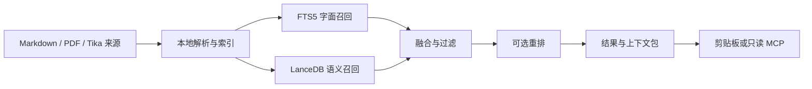

<div align="center">


# Caelune（凯露恩）

**面向 Windows 的本地优先知识检索工具与只读 MCP Server，用来搜索私有 Markdown、PDF 和 Tika 扩展资料库。**

[](https://github.com/EllisMorrow/Caelune/releases/latest)
[](https://github.com/EllisMorrow/Caelune/releases/latest)
[](#隐私边界)
[](https://registry.modelcontextprotocol.io/v0/servers?search=io.github.EllisMorrow/caelune-mcp)
[](https://github.com/EllisMorrow/Caelune/releases)
[](LICENSE)

[下载 Windows 版](https://github.com/EllisMorrow/Caelune/releases/latest) ·
[English README](README.md) ·
[官方网站](https://ellismorrow.github.io/Caelune/) ·
[使用 Wiki](https://github.com/EllisMorrow/Caelune/wiki) ·
[MCP 接入说明](MCP_SETUP.md)

</div>

## 凯露恩能做什么

凯露恩会在你的电脑上为现有知识资料建立本地索引，把精确文字检索、结构信号、语义向量检索、可选重排和来源明确的上下文组装结合起来。

桌面版负责管理数据目录、Runtime、模型、知识库建库、热监听、查询和结果查看。可选的 MCP Server 则通过两个只读工具，把同一套检索能力提供给支持 MCP 的 AI 客户端。

<div align="center">
  
  <br />
  <sub>在本地查询 Markdown、PDF 和其他文档，直接查看带来源的结果，或将选定证据提供给 AI。</sub>
</div>

### 按目标选择入口

| 我想要…… | 从这里开始 |
| --- | --- |
| 安装 Windows 版并完成第一次建库 | [快速开始](https://github.com/EllisMorrow/Caelune/wiki/Getting-Started) |
| 了解 Runtime、模型、CPU、CUDA 或资源提示 | [Runtime 与模型](https://github.com/EllisMorrow/Caelune/wiki/Runtime-and-Models) |
| 让笔记修改后自动进入索引 | [知识库与热监听](https://github.com/EllisMorrow/Caelune/wiki/Knowledge-Bases-and-Live-Watch) |
| 通过 MCP 连接 AI 客户端 | [MCP 接入](https://github.com/EllisMorrow/Caelune/wiki/MCP-Integration) |
| 安全排查故障 | [故障排查](https://github.com/EllisMorrow/Caelune/wiki/Troubleshooting) |

## 界面预览

查询台集中放置问题输入、检索范围、查询设置与实时阶段状态；“结果与详情”使用独立页面展示带来源标签的命中结果、片段详情、完整上下文选择和页面过滤。

<div align="center">
  <a href="docs/assets/readme-query-console-zh-CN.png">
    
  </a>
  <br />
  <sub>查询台 · 点击图片可查看原始尺寸</sub>
</div>

<br />

<div align="center">
  <a href="docs/assets/readme-results-details-zh-CN.png">
    
  </a>
  <br />
  <sub>结果与详情 · 点击图片可查看原始尺寸</sub>
</div>

## 下载

进入[最新版本 Releases](https://github.com/EllisMorrow/Caelune/releases/latest)，根据用途选择文件：

| 文件标识 | 用途 |
| --- | --- |
| `WIN-EXE` | 普通 Windows 桌面使用：配置、建库、热监听、查询和查看结果 |
| `MCP-...-win64.zip` | 手动配置本地 `stdio` MCP 客户端 |
| `.mcpb` | MCP Registry 或支持 MCPB 的客户端 |

> MCP 包不会建立或修改知识库。第一次使用必须先通过 Windows 桌面版完成建库。

## 核心能力

- **本地优先存储**：索引、配置、模型、日志和 Runtime 都保存在当前启用的本地数据目录中。
- **理解 Markdown 与 Logseq**：除普通 Markdown 外，也处理常见的 Logseq 页面属性、块属性、块引用和嵌入。
- **混合检索**：结合 SQLite FTS5、结构评分、LanceDB 向量检索、`BAAI/bge-m3` 和可选的 `BAAI/bge-reranker-v2-m3`。
- **PDF 与 Tika 扩展资料库**：扩展格式使用独立索引，再以明确来源标签合并展示。Tika 目录会暴露1,290种格式条目，实际兼容性仍取决于文件内容和解析器。
- **事件驱动热监听**：只响应真实文件变化，等待可配置的安静时间后再进行增量更新，并使用一次性子进程释放资源。
- **查询阶段可见**：准备、字面召回、语义召回、融合、重排、结果整理和上下文组装都会显示在查询台。
- **根据资源自动执行**：Auto 会优先使用可用的 NVIDIA CUDA；Windows Commit、物理内存或显存不足时会安全降级。
- **只读 MCP 接口**：AI 客户端可以查看状态和查询，但不能建库、删除数据或修改配置。

## 隐私边界

凯露恩是“本地优先”软件，但不对所有可能的使用方式作绝对离线承诺。

- 建库时只读取来源文件；正常建库和移除来源操作不会删除或改写原始笔记和文档。
- 只有在用户主动下载 Runtime、模型、Java 或 Tika 等组件时才需要网络。
- 检索内容只有在你复制、导出，或者明确允许 MCP 客户端查询时才会离开软件界面。
- 发送给第三方 AI 的内容仍受对应服务自身隐私政策约束。

请为重要资料保留备份，并在高风险场景中核对检索内容。

## 快速开始

1. 下载文件名中带有 `WIN-EXE` 的发行包。
2. 解压后运行 `Caelune.exe`。
3. 等待启动时的 Runtime 自动检测完成。
4. 选择本地数据目录，并添加一个或多个 Markdown 知识库目录。
5. 如果软件提示缺少组件，请在 Runtime 页面安装或修复 CPU/CUDA Runtime 和本地模型。
6. 第一次执行一次全量建库。
7. 在查询台开始搜索；如果希望后续修改自动进入索引，再开启热监听。

完整步骤请看：[快速开始 Wiki](https://github.com/EllisMorrow/Caelune/wiki/Getting-Started)。

## 实际运行条件

- 64位 Windows
- 足够容纳程序、外置 Runtime、本地模型和索引的磁盘空间
- 第一次下载 Runtime 和模型时需要联网，除非手动准备安装文件
- 支持 CPU；兼容的 NVIDIA 显卡和驱动是可选加速条件
- 大型知识库和本地 AI 模型建议启用 Windows 自动管理分页文件

Runtime 和模型采用外置目录，可以在多个软件版本间复用健康组件。详细说明见：[Runtime 与模型](https://github.com/EllisMorrow/Caelune/wiki/Runtime-and-Models)。

## 检索流程


```mermaid
flowchart LR
    A["Markdown / PDF / Tika 来源"] --> B["本地解析与索引"]
    B --> C["FTS5 字面召回"]
    B --> D["LanceDB 语义召回"]
    C --> E["融合与过滤"]
    D --> E
    E --> F["可选重排"]
    F --> G["结果与上下文包"]
    G --> H["剪贴板或只读 MCP"]
```

## 一分钟了解 MCP

1. 先用桌面版建立至少一个知识库。
2. 手动配置 `stdio` 时下载 MCP ZIP；支持 Registry/MCPB 时使用对应发布包。
3. 在兼容客户端中指向 `Caelune-MCP.exe`。
4. 客户端可以调用：
   - `omniclip.status`：查看环境是否就绪以及当前检索模式
   - `omniclip.search`：取得带来源标签的检索结果

部分客户端不能直接连接本地 `stdio` Server，需要本地代理。请看 [MCP 接入 Wiki](https://github.com/EllisMorrow/Caelune/wiki/MCP-Integration) 和 [MCP_SETUP.md](MCP_SETUP.md)。

## 使用文档

### 用户指南

| 主题 | 文档 |
| --- | --- |
| 安装与第一次建库 | [快速开始](https://github.com/EllisMorrow/Caelune/wiki/Getting-Started) |
| Runtime、模型、CPU 与 CUDA | [Runtime 与模型](https://github.com/EllisMorrow/Caelune/wiki/Runtime-and-Models) |
| 知识库与热监听 | [知识库与热监听](https://github.com/EllisMorrow/Caelune/wiki/Knowledge-Bases-and-Live-Watch) |
| 查询阶段与资源提示 | [查询与资源管理](https://github.com/EllisMorrow/Caelune/wiki/Search-and-Resources) |
| PDF 与 Tika 来源 | [PDF 与 Tika](https://github.com/EllisMorrow/Caelune/wiki/PDF-and-Tika) |
| MCP 客户端和工具 | [MCP 接入](https://github.com/EllisMorrow/Caelune/wiki/MCP-Integration) |
| 常见问题 | [故障排查](https://github.com/EllisMorrow/Caelune/wiki/Troubleshooting) |

### 项目参考

- [架构说明](ARCHITECTURE.md)
- [Runtime 技术说明](RUNTIME_SETUP.md)
- [MCP 技术说明](MCP_SETUP.md)
- [更新日志](CHANGELOG.md)
- [第三方许可与声明](THIRD_PARTY_NOTICES.md)
- [历史版本](https://github.com/EllisMorrow/Caelune/releases)

## 开发入口

```powershell
# 启动桌面 GUI
.\scripts\run_gui.ps1

# CLI 状态与查询
.\scripts\run.ps1 status
.\scripts\run.ps1 query "你的问题"

# 构建 Windows 发布包
.\scripts\build_exe.ps1

# 从源码运行 MCP 自检
python launcher_mcp.py --mcp-selfcheck
```

开发者入口和架构索引请看：[开发与架构 Wiki](https://github.com/EllisMorrow/Caelune/wiki/Development-and-Architecture)。

## 许可证与第三方软件

凯露恩采用 [MIT License](LICENSE)。项目使用了 PySide6、SQLite、LanceDB、Apache Arrow、PyTorch、sentence-transformers、Transformers、BGE 模型、PyPDF、Apache Tika、Eclipse Temurin、watchdog、PyInstaller 和 Model Context Protocol SDK 等开源项目。

仓库级许可和分发说明见 [THIRD_PARTY_NOTICES.md](THIRD_PARTY_NOTICES.md)。

> 凯露恩及其检索结果不提供任何担保。请核对重要结果、保留资料备份，也不要把检索内容或下游 AI 输出作为医疗、法律、金融、安全关键或其他高风险决策的唯一依据。
